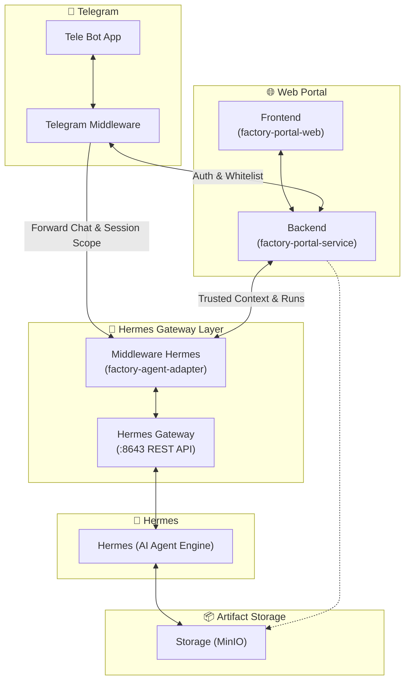

# 📱 Telegram Hermes Gateway Assessment & Solution

Repository ini berisi dokumentasi analisis teknis, perancangan arsitektur, dan panduan integrasi Telegram Bot dengan Hermes AI Gateway (1 Pintu) beserta mekanisme Trusted Context, User Whitelist, dan Isolasi Sesi.

---

## 📚 Daftar Dokumen

1. **[TELEGRAM_BOT_HERMES_MIDDLEWARE_SOLUTION.md](TELEGRAM_BOT_HERMES_MIDDLEWARE_SOLUTION.md)**  
   Solusi teknis arsitektur lengkap: Telegram Bot Middleware, Whitelist Number via Native Contact, RBAC Project Switching, Scoped Session ID, dan Redis Trusted Context.

2. **[TELEGRAM_HERMES_SIMPLE_ASSESSMENT_AND_TASK_BREAKDOWN.md](TELEGRAM_HERMES_SIMPLE_ASSESSMENT_AND_TASK_BREAKDOWN.md)**  
   Assessment ringkas, diagram alur high-level design (Mermaid), tech stack, dan daftar task implementasi yang terstruktur.

3. **[TELEGRAM_HERMES_INTEGRATION_ASSESSMENT_PLAN.md](TELEGRAM_HERMES_INTEGRATION_ASSESSMENT_PLAN.md)**  
   Rencana assessment integrasi Telegram Bot dengan Hermes Gateway.

4. **[2026-08-27-telegram-bot-trusted-context-grilling.md](2026-08-27-telegram-bot-trusted-context-grilling.md)**  
   Catatan diskusi mendalam (grilling session) mengenai context flow, keamanan, dan integrasi backend.

---

## 🏗️ High-Level Architecture Overview

