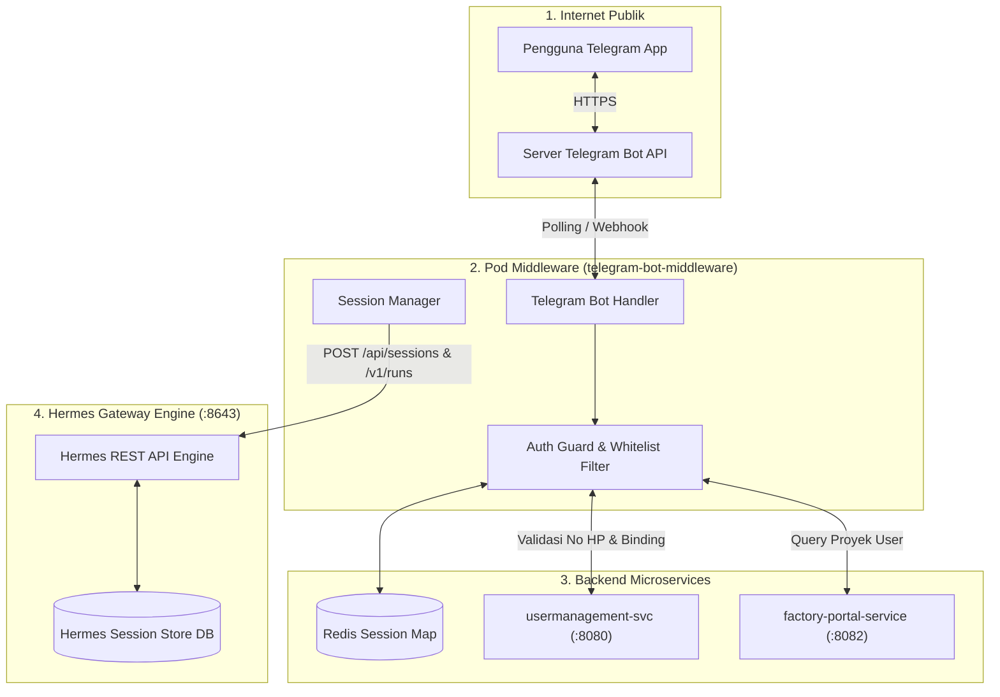
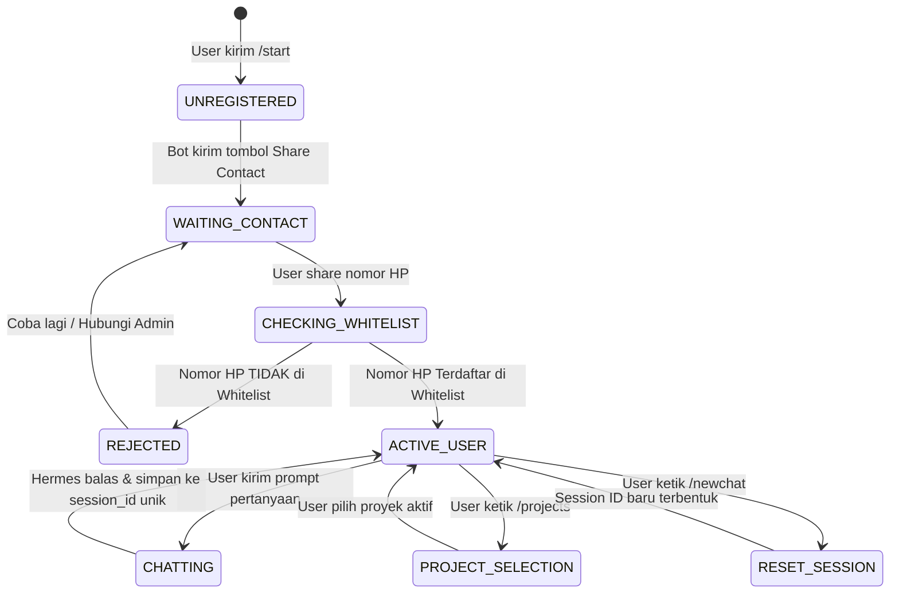
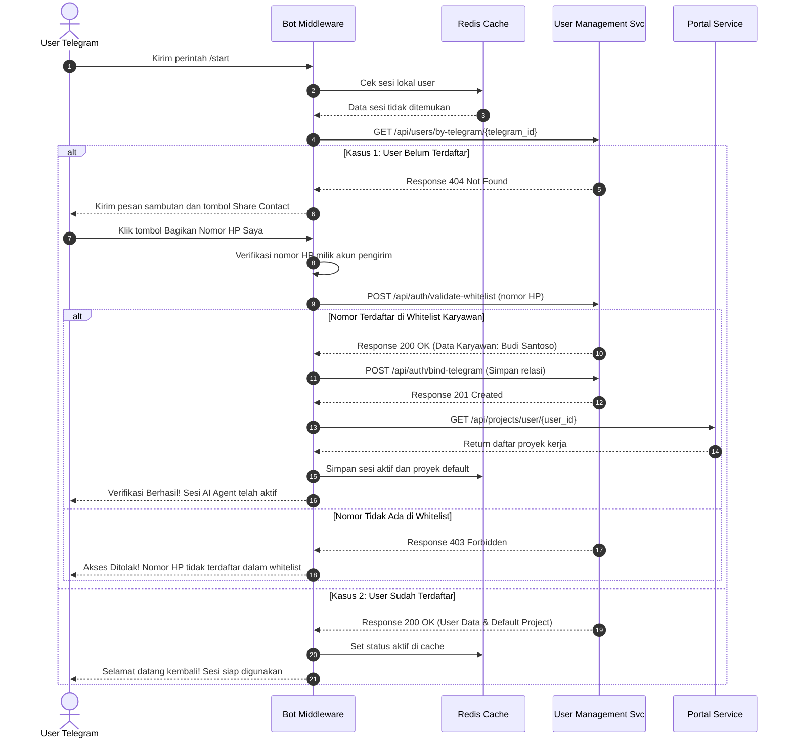
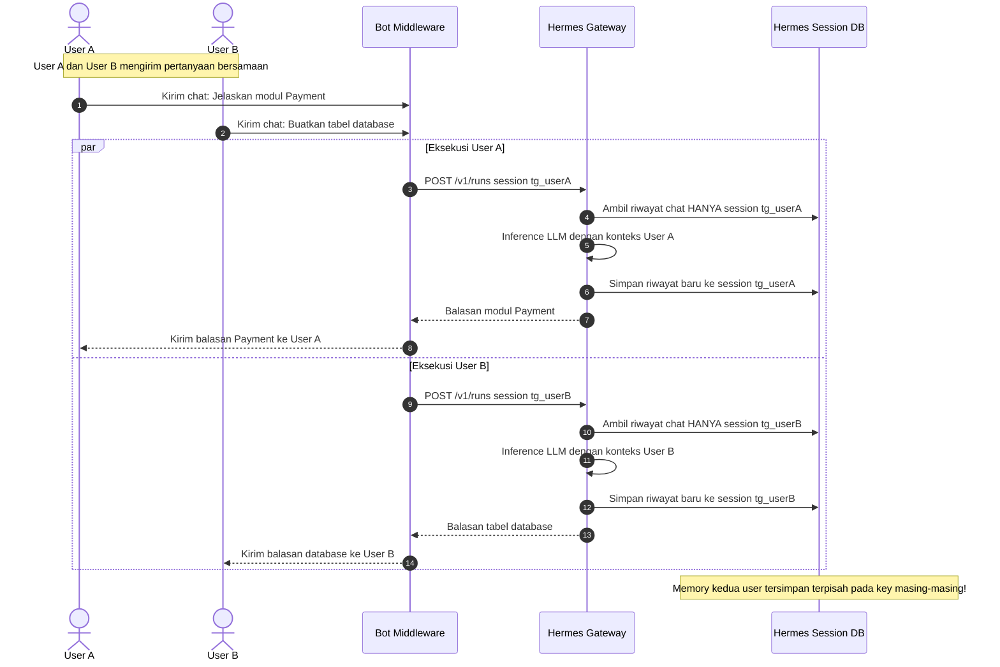
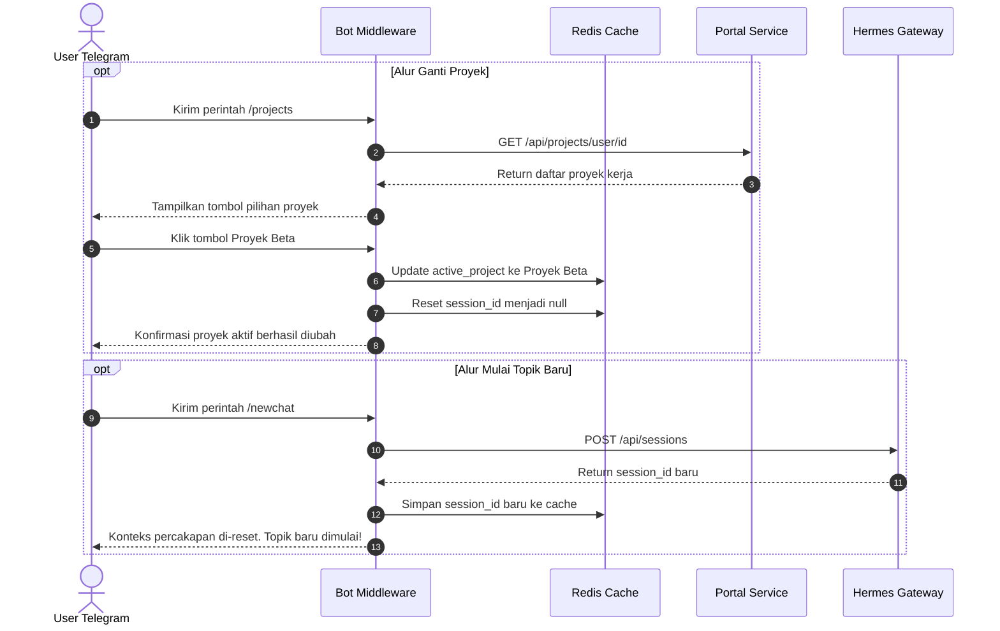

# 🤖 Solusi Arsitektur & Panduan Step-by-Step: Telegram Bot Standalone Gateway Middleware untuk Hermes

> **Tanggal:** 28 Agustus 2026  
> **Dokumen Versi:** 2.0 (Enhanced Visual Diagrams & Step-by-Step Implementation Guide)  
> **Target Audience:** Engineering Leads, Backend Developers, AI Engineers, & DevOps  

---

## 📑 Daftar Isi
1. [Latar Belakang & Akar Masalah (Root Cause Analysis)](#1-latar-belakang--akar-masalah-root-cause-analysis)
2. [Arsitektur Solusi: Middleware Adapter Pattern](#2-arsitektur-solusi-middleware-adapter-pattern)
3. [Visualisasi Diagram Lengkap](#3-visualisasi-diagram-lengkap)
   - [3.1 Diagram Topologi Infrastruktur Kubernetes](#31-diagram-topologi-infrastruktur-kubernetes)
   - [3.2 Diagram State Machine Lifecycle Pengguna](#32-diagram-state-machine-lifecycle-pengguna)
   - [3.3 Sequence Diagram: Onboarding & Registrasi Nomor HP](#33-sequence-diagram-onboarding--registrasi-nomor-hp)
   - [3.4 Sequence Diagram: Eksekusi Chat & Isolasi Memori Hermes](#34-sequence-diagram-eksekusi-chat--isolasi-memori-hermes)
   - [3.5 Sequence Diagram: Switch Proyek & Reset Sesi (/newchat)](#35-sequence-diagram-switch-proyek--reset-sesi-newchat)
4. [Panduan Pengerjaan Step-by-Step (A to Z)](#4-panduan-pengerjaan-step-by-step-a-to-z)
   - [Langkah 1: Setup Bot di BotFather (Telegram)](#langkah-1-setup-bot-di-botfather-telegram)
   - [Langkah 2: Re-konfigurasi Hermes Gateway di Kubernetes](#langkah-2-re-konfigurasi-hermes-gateway-di-kubernetes)
   - [Langkah 3: Penyiapan Skema DB & Endpoint di User Management](#langkah-3-penyiapan-skema-db--endpoint-di-user-management)
   - [Langkah 4: Struktur Project Middleware Bot](#langkah-4-struktur-project-middleware-bot)
   - [Langkah 5: Kode Implementasi Lengkap (Production-Ready)](#langkah-5-kode-implementasi-lengkap-production-ready)
   - [Langkah 6: Build Container & Deployment ke Kubernetes](#langkah-6-build-container--deployment-ke-kubernetes)
   - [Langkah 7: Pengujian & Validasi Isolasi Memori Multi-User](#langkah-7-pengujian--validasi-isolasi-memori-multi-user)
5. [Tabel Komparasi: Sebelum vs Sesudah](#5-tabel-komparasi-sebelum-vs-sesudah)

---

## 1. Latar Belakang & Akar Masalah (Root Cause Analysis)

### 1.1 Kondisi Saat Ini (Direct Setup via CLI)
Sebelumnya, Telegram Bot dihubungkan langsung ke Hermes Gateway Server di Kubernetes menggunakan CLI bawaan (`./hermes gateway setup`). Setup ini menimbulkan 3 masalah fatal:

```
[ Telegram User A ] ──┐
                      ├─► [ Hermes Gateway (Single Session) ] ──► [ LLM Engine ]
[ Telegram User B ] ──┘            ▲
                                   │
                      ⚠️ Memory Tercampur / Tumpang Tindih!
```

1. **Memory Collision / Context Bleed (Tumpang Tindih)**:
   - CLI bawaan Hermes didesain untuk *single-developer testing*.
   - Saat dideploy ke Kubernetes dan menerima webhook Telegram dari banyak user secara bersamaan, Hermes memasukkan seluruh interaksi ke **satu ruang memori/sesi global yang sama**.
   - User B bisa membaca percakapan User A, atau jawaban AI untuk User B dipengaruhi oleh instruksi yang dikirim User A sebelumnya.
2. **Ketiadaan Autentikasi & Whitelist (Akses Publik Ilegal)**:
   - Hermes Gateway murni bertindak sebagai *Inference Engine*, bukan *Identity Provider*.
   - Siapa pun di Telegram yang menemukan username bot bisa langsung mengirim chat dan menghabiskan kuota token LLM tanpa terdaftar.
3. **Ketiadaan Konteks Proyek & RBAC**:
   - Hermes tidak mengenali apakah user tersebut berhak atas Proyek A atau Proyek B, serta tidak memiliki JWT token untuk mengeksekusi integrasi lanjutan (GitLab, storage dokumen).

---

## 2. Arsitektur Solusi: Middleware Adapter Pattern

Solusi terbaik adalah membangun **Telegram Bot Gateway Middleware** sebagai satu service/pod terpisah yang bertindak sebagai *Security & Identity Gatekeeper*.

```
[ Telegram User A ] ──► [ Telegram Bot Middleware ] ──► session_id: tg_USR_A ──► [ Hermes Gateway ]
[ Telegram User B ] ──► [  (Auth & Session Map)   ] ──► session_id: tg_USR_B ──► [ (Memory Terisolasi) ]
                                   │
                                   ▼
                       [ usermanagement-svc ]
                       (Whitelist & DB User)
```

### Prinsip Kerja Utama:
1. **100% Standalone UX**: Pengguna melakukan semua hal (registrasi via verifikasi nomor telepon, memilih proyek, mengganti peran agent, dan chatting) langsung dari antarmuka Telegram tanpa wajib login ke website portal.
2. **Standard Enterprise Flow**: Middleware memanggil endpoint backend yang sama dengan Web Portal (`usermanagement-svc` untuk validasi akun, `factory-portal-service` untuk daftar proyek).
3. **Strict Session Scoping**: Middleware mengalokasikan `session_id` unik untuk setiap pasangan `(telegram_user_id, project_id)` sebelum memanggil API Hermes Gateway (`/api/sessions` dan `/v1/runs`).

---

## 3. Visualisasi Diagram Lengkap

Berikut adalah visualisasi lengkap arsitektur sistem. Setiap bagian dilengkapi dengan **Diagram Visual Teks (ASCII)** yang bisa langsung dibaca tanpa renderer, **Diagram Mermaid**, serta **Tabel Rincian Langkah**.

---

### 3.1 Diagram Topologi Infrastruktur Kubernetes

#### A. Diagram Visual Teks (Infrastruktur & Jaringan)

```text
+---------------------------------------------------------------------------------------------------------+
|                                           INTERNET PUBLIK                                               |
|                                                                                                         |
|   [ 📱 Aplikasi Telegram User ] <==== HTTPS =====> [ ☁️ Server Telegram Bot API (api.telegram.org) ]     |
+------------------------------------------------------------------+--------------------------------------+
                                                                   | Long Polling / Webhook
                                                                   v
+---------------------------------------------------------------------------------------------------------+
|                                    KUBERNETES CLUSTER (eksad-agentic)                                    |
|                                                                                                         |
|  +---------------------------------------------------------------------------------------------------+  |
|  | Pod: telegram-bot-middleware                                                                      |  |
|  |                                                                                                   |  |
|  |   [ Telegram Bot Engine ] ──► [ Auth Guard & State Machine ] ──► [ Session & Routing Controller ] |  |
|  +-------------------+-----------------------------+------------------------------------+------------+  |
|                      |                             |                                    |               |
|                      v                             v                                    v               |
|          +-----------------------+     +------------------------+          +-------------------------+  |
|          | Pod: redis-state-map  |     | usermanagement-svc     |          | factory-portal-service  |  |
|          | (Port 6379)           |     | (Port 8080)            |          | (Port 8082)             |  |
|          |                       |     |                        |          |                         |  |
|          | • tele_id <-> user_id |     | • employee_whitelist   |          | • Daftar Proyek User    |  |
|          | • tele_id <-> sess_id |     | • validasi nomor HP    |          | • RBAC & Role Model     |  |
|          +-----------------------+     +------------------------+          +-------------------------+  |
|                                                                                         |               |
|                                                                                         |               |
|                                                                                         v               |
|                                                                            +-------------------------+  |
|                                                                            | Pod: hermes-gateway     |  |
|                                                                            | (Port 8643 REST API)    |  |
|                                                                            |                         |  |
|                                                                            | POST /api/sessions      |  |
|                                                                            | POST /v1/runs           |  |
|                                                                            +------------+------------+  |
|                                                                                         |               |
|                                                                                         v               |
|                                                                            +-------------------------+  |
|                                                                            | Hermes Session DB       |  |
|                                                                            | (Memori Terisolasi      |  |
|                                                                            |  per session_id)        |  |
|                                                                            +-------------------------+  |
+---------------------------------------------------------------------------------------------------------+
```

#### B. Diagram Mermaid (Topologi Service)



---

### 3.2 Diagram State Machine Lifecycle Pengguna

#### A. Diagram Visual Teks (Status Transisi User)

```text
[ USER KETIK /start ]
         |
         v
+------------------------------------+
| Status: UNREGISTERED               | <------------------------------------+
| (User belum terdaftar di sistem)   |                                      |
+-----------------+------------------+                                      |
                  |                                                         |
                  v Kirim tombol "Bagikan Nomor HP"                         |
+------------------------------------+                                      |
| Status: WAITING_CONTACT            |                                      |
| (Menunggu user menekan tombol HP)  |                                      |
+-----------------+------------------+                                      |
                  |                                                         |
                  v User kirim kontak native                                |
+------------------------------------+        Nomor TIDAK ADA di Whitelist  |
| Status: CHECKING_WHITELIST         | -------------------------------------+
| (Validasi ke usermanagement-svc)   | (Akses Ditolak & Tampilkan Pesan Error)
+-----------------+------------------+
                  |
                  v Nomor VALID di Whitelist Karyawan
+------------------------------------+
| Status: REGISTERED & ACTIVE        |
| (Akun terikat dengan telegram_id)  |
+-----------------+------------------+
                  |
                  +---------------------------------------------------------+
                  |                                                         |
                  v Kirim pesan teks                                        v Ketik /projects
+------------------------------------+                    +------------------------------------+
| Status: CHATTING (ISOLATED)        |                    | Status: SELECTING_PROJECT          |
| (Eksekusi prompt ke Hermes via     |                    | (Pilih Proyek dari Inline Buttons) |
|  session_id khusus user tersebut)  |                    +------------------------------------+
+------------------------------------+
```

#### B. Diagram Mermaid (State Diagram)



---

### 3.3 Sequence Diagram: Onboarding & Registrasi Nomor HP

#### A. Diagram Visual Teks (Alur Registrasi /start)

```text
User Telegram             Bot Middleware            usermanagement-svc           Redis State Cache
     |                          |                           |                            |
     |---- 1. /start ---------->|                           |                            |
     |                          |---- 2. Cek Cache -------->|                            |
     |                          |<--- 3. Belum Ada ---------|                            |
     |                          |                                                        |
     |                          |---- 4. GET /api/users/by-telegram/{id} --------------->|
     |                          |<--- 5. 404 Not Found (Belum Terdaftar) ----------------|
     |                          |                                                        |
     |<--- 6. Minta No HP ------| (Kirim KeyboardButton: [📱 Bagikan Nomor HP Saya])     |
     |        (Tombol Native)   |                                                        |
     |                          |                                                        |
     |---- 7. Klik Share HP --->| (Membawa Contact Object: phone_number & user_id)       |
     |                          |                                                        |
     |                          |---- 8. Validasi Anti-Spoofing (contact.id == user.id)  |
     |                          |---- 9. POST /api/auth/validate-whitelist ------------->|
     |                          |<--- 10. 200 OK (Nomor Terdaftar: Budi Santoso) --------|
     |                          |                                                        |
     |                          |---- 11. POST /api/auth/bind-telegram ----------------->|
     |                          |<--- 12. 201 Created (User Aktif) ----------------------|
     |                          |                                                        |
     |                          |---- 13. Simpan data user ke Redis -------------------->|
     |<--- 14. "Regis Sukses!---|                                                        |
     |         Siap Chat"       |                                                        |
```

#### B. Diagram Mermaid (Sequence Onboarding)



#### C. Tabel Rincian Langkah Onboarding:

| Langkah | Aktor Pengirim $\rightarrow$ Penerima | Endpoint / Aksi | Keterangan Data |
|---|---|---|---|
| **1 - 3** | User $\rightarrow$ Bot $\rightarrow$ Cache | `/start` | Bot memeriksa apakah `telegram_id` sudah ada di cache lokal. |
| **4 - 5** | Bot $\rightarrow$ `usermanagement-svc` | `GET /api/users/by-telegram/{id}` | Memeriksa apakah Telegram ID ini sudah pernah di-bind ke akun. |
| **6 - 7** | Bot $\leftrightarrow$ User | `request_contact=True` | Bot menampilkan tombol *Share Contact* native Telegram untuk verifikasi nomor HP. |
| **8** | Internal Bot | Anti-Spoofing Check | Memastikan `contact.user_id == update.effective_user.id`. |
| **9 - 10** | Bot $\rightarrow$ `usermanagement-svc` | `POST /api/auth/validate-whitelist` | Payload: `{"phone_number": "+628123456789"}`. Mengembalikan nama & status karyawan. |
| **11 - 12**| Bot $\rightarrow$ `usermanagement-svc` | `POST /api/auth/bind-telegram` | Payload: `{"employee_id": "EMP-01", "telegram_id": "123"}`. Binding permanen. |
| **13 - 14**| Bot $\rightarrow$ Cache $\rightarrow$ User | Selesai | Mengaktifkan sesi chat dan memberi tahu user bahwa AI siap digunakan. |

---

### 3.4 Sequence Diagram: Eksekusi Chat & Isolasi Memori Hermes

#### A. Diagram Visual Teks (Pencegahan Memory Tumpang Tindih)

```text
[ USER A (Telegram ID: 111) ]                     [ USER B (Telegram ID: 222) ]
              |                                                 |
              | 1. Chat: "Topik Payment Gateway"               | 1. Chat: "Topik Database User"
              v                                                 v
+-------------------------------------------------------------------------------+
|                       TELEGRAM BOT MIDDLEWARE                                 |
|                                                                               |
|  • User A dipetakan ke: session_id = "tg_111_session_A"                      |
|  • User B dipetakan ke: session_id = "tg_222_session_B"                      |
+-----------------------+-------------------------------+-----------------------+
                        |                               |
     2. POST /v1/runs   |                               | 2. POST /v1/runs
   (session: "tg_111")  |                               |  (session: "tg_222")
                        v                               v
+-------------------------------------------------------------------------------+
|                       HERMES GATEWAY API SERVER (:8643)                       |
|                                                                               |
|  • Menjalankan Agent untuk session "tg_111"    • Menjalankan Agent untuk      |
|    secara independen                             session "tg_222" secara       |
|                                                  independen                   |
+-----------------------+-------------------------------+-----------------------+
                        |                               |
                        v                               v
+-------------------------------------------------------------------------------+
|                       HERMES SESSION DATABASE                                 |
|                                                                               |
|  [ Record Session: tg_111_session_A ]          [ Record Session: tg_222_session_B ]
|  - User: "Topik Payment Gateway"               - User: "Topik Database User" |
|  - AI: "Arsitektur Payment..."                 - AI: "Skema Tabel User..."    |
|                                                                               |
|  >>> MEMORI USER A DAN USER B 100% TERPISAH, TIDAK ADA TUMPANG TINDIH! <<<    |
+-------------------------------------------------------------------------------+
```

#### B. Diagram Mermaid (Sequence Chatting Terisolasi)



---

### 3.5 Sequence Diagram: Switch Proyek & Reset Sesi (`/newchat`)

#### A. Diagram Visual Teks (Ganti Proyek & Reset Topik)

```text
GANTI PROYEK (/projects):
User ---> Ketik /projects ---> Bot minta list proyek ke PortalSvc ---> Bot kirim tombol pilihan
User ---> Klik [📁 Proyek Beta] ---> Bot ganti active_project_id ---> Sesi Hermes di-reset

RESET TOPIK BARU (/newchat):
User ---> Ketik /newchat ---> Bot panggil POST /api/sessions ke Hermes ---> Hermes buat session_id baru
Bot ---> Update session_id di Cache ---> User mulai topik baru tanpa ingatan chat lama
```

#### B. Diagram Mermaid (Sequence Switch & Reset)



#### C. Tabel Rincian Langkah Switch Proyek & Reset Sesi:

| Aksi | Perintah / Endpoint | Aktor & Alur | Keterangan Teknis |
|---|---|---|---|
| **Ganti Proyek** | `/projects` | User $\rightarrow$ Bot $\rightarrow$ `factory-portal-service` | Bot mengambil daftar proyek yang boleh diakses user sesuai hak RBAC. |
| **Pilih Proyek** | `CallbackQuery (proj_id)` | User $\rightarrow$ Bot $\rightarrow$ Cache | Bot mengubah `active_project_id` dan me-reset `session_id` agar topik percakapan sesuai konteks proyek baru. |
| **Reset Topik** | `/newchat` | User $\rightarrow$ Bot $\rightarrow$ Hermes Gateway | Bot memanggil `POST /api/sessions` untuk membuat sesi baru di Hermes dan menyimpan ID baru tersebut di cache. |

---

## 4. Panduan Pengerjaan Step-by-Step (A to Z)

Berikut adalah panduan eksekusi teknis langkah demi langkah untuk membangun dan mendeploy Telegram Bot Middleware ke Kubernetes:

---

### Langkah 1: Setup Bot di BotFather (Telegram)

1. Buka aplikasi Telegram dan cari `@BotFather`.
2. Kirim perintah `/newbot` untuk membuat bot baru:
   - Masukkan nama bot, contoh: `Eksad Factory Agent Bot`.
   - Masukkan username bot (harus berakhiran `bot`), contoh: `eksad_factory_agent_bot`.
3. Simpan **Bot Token** yang diberikan (contoh: `7123456789:AAFxxx_xxxxxx-xxxx`).
4. Matikan *Group Privacy* (opsional, jika ingin bot bisa dimasukkan ke group internal):
   - Kirim `/setprivacy` -> Pilih bot Anda -> Pilih `Disable`.
5. Daftarkan menu perintah bawaan bot:
   - Kirim `/setcommands` -> Pilih bot Anda -> Salin teks berikut:
     ```text
     start - Mulai bot dan verifikasi akun
     newchat - Reset topik percakapan baru
     projects - Pilih proyek kerja aktif
     model - Pilih peran AI Agent (SA / BA)
     status - Lihat info akun dan sesi aktif
     help - Panduan bantuan penggunaan
     ```

---

### Langkah 2: Re-konfigurasi Hermes Gateway di Kubernetes

Tujuan: Memastikan Hermes Gateway **TIDAK** menjalankan runner Telegram bawaan, melainkan murni sebagai HTTP REST API Engine.

1. Buka manifest Deployment Hermes Gateway Anda (`deployment-hermes.yaml`).
2. Pastikan container command/args hanya menjalankan HTTP API Server (default port `:8643`):
   ```yaml
   spec:
     containers:
       - name: hermes-gateway
         image: hermes-gateway:v0.19.0
         command: ["./hermes", "gateway", "serve", "--port", "8643"]
         ports:
           - containerPort: 8643
             name: http-api
   ```
3. Pastikan Service Kubernetes untuk Hermes Gateway telah aktif:
   ```yaml
   apiVersion: v1
   kind: Service
   metadata:
     name: hermes-gateway-svc
     namespace: eksad-agentic
   spec:
     selector:
       app: hermes-gateway
     ports:
       - port: 8643
         targetPort: 8643
   ```
4. Verifikasi Health Endpoint dari dalam cluster:
   ```bash
   curl http://hermes-gateway-svc.eksad-agentic.svc.cluster.local:8643/health
   # Response yang diharapkan: {"status": "healthy", "service": "hermes-gateway"}
   ```

---

### Langkah 3: Penyiapan Skema DB & Endpoint di User Management

Tim backend `usermanagement-svc` perlu menyiapkan tabel relasi dan 3 endpoint pendukung:

#### 3.1 Skema Tabel Relasi (PostgreSQL / MySQL)
```sql
-- Tabel Whitelist Karyawan yang Berhak Akses
CREATE TABLE employee_whitelist (
    id VARCHAR(64) PRIMARY KEY,
    employee_id VARCHAR(32) UNIQUE NOT NULL,
    full_name VARCHAR(128) NOT NULL,
    phone_number VARCHAR(32) UNIQUE NOT NULL, -- Format internasional e.g. +628123456789
    email VARCHAR(128) UNIQUE NOT NULL,
    default_role VARCHAR(32) DEFAULT 'SYSTEM_ANALYST',
    is_active BOOLEAN DEFAULT TRUE,
    created_at TIMESTAMP DEFAULT CURRENT_TIMESTAMP
);

-- Tabel Binding Akun Telegram ke User
CREATE TABLE telegram_user_bindings (
    telegram_id VARCHAR(64) PRIMARY KEY,
    employee_id VARCHAR(32) NOT NULL REFERENCES employee_whitelist(employee_id),
    telegram_username VARCHAR(64),
    phone_number VARCHAR(32) NOT NULL,
    is_verified BOOLEAN DEFAULT TRUE,
    bound_at TIMESTAMP DEFAULT CURRENT_TIMESTAMP,
    last_active TIMESTAMP DEFAULT CURRENT_TIMESTAMP
);
```

#### 3.2 Endpoint REST API yang Wajib Tersedia di `usermanagement-svc`
1. `GET /api/users/by-telegram/{telegram_id}`
   - Return `200 OK` jika sudah terdaftar, return `404 Not Found` jika belum.
2. `POST /api/auth/validate-whitelist`
   - Request: `{"phone_number": "+628123456789"}`
   - Return `200 OK` jika nomor ada di `employee_whitelist`.
3. `POST /api/auth/bind-telegram`
   - Request: `{"employee_id": "EMP-01", "telegram_id": "12345678", "phone_number": "+628123456789", "username": "budi"}`
   - Return `201 Created` untuk menyimpan binding ke database.

---

### Langkah 4: Struktur Project Middleware Bot

Buat repository/direktori baru untuk middleware, contoh `factory-telegram-middleware`:

```text
factory-telegram-middleware/
├── Dockerfile
├── requirements.txt
├── .env.example
├── README.md
├── k8s/
│   ├── deployment.yaml
│   ├── service.yaml
│   └── secret.yaml
└── src/
    ├── __init__.py
    ├── config.py
    ├── main.py
    ├── clients/
    │   ├── __init__.py
    │   ├── hermes_client.py
    │   └── user_svc_client.py
    ├── handlers/
    │   ├── __init__.py
    │   ├── auth_handler.py
    │   ├── command_handler.py
    │   └── message_handler.py
    └── state/
        ├── __init__.py
        └── session_store.py
```

---

### Langkah 5: Kode Implementasi Lengkap (Production-Ready)

#### 5.1 `requirements.txt`
```text
python-telegram-bot[job-queue]==21.5
httpx==0.27.2
redis==5.0.8
pydantic==2.8.2
pydantic-settings==2.4.0
uvicorn==0.30.6
fastapi==0.112.2
```

#### 5.2 `src/config.py`
```python
import os
from pydantic_settings import BaseSettings

class Settings(BaseSettings):
    TELEGRAM_BOT_TOKEN: str = os.getenv("TELEGRAM_BOT_TOKEN", "")
    HERMES_BASE_URL: str = os.getenv("HERMES_BASE_URL", "http://hermes-gateway-svc.eksad-agentic.svc.cluster.local:8643")
    HERMES_API_KEY: str = os.getenv("HERMES_API_KEY", "default-hermes-key")
    USER_SVC_URL: str = os.getenv("USER_SVC_URL", "http://usermanagement-svc.eksad-agentic.svc.cluster.local:8080")
    PORTAL_SVC_URL: str = os.getenv("PORTAL_SVC_URL", "http://factory-portal-service.eksad-agentic.svc.cluster.local:8082")
    REDIS_HOST: str = os.getenv("REDIS_HOST", "localhost")
    REDIS_PORT: int = int(os.getenv("REDIS_PORT", "6379"))
    DEFAULT_MODEL: str = "system-analyst"

settings = Settings()
```

#### 5.3 `src/clients/hermes_client.py`
```python
import httpx
import logging
from src.config import settings

logger = logging.getLogger(__name__)

class HermesClient:
    def __init__(self):
        self.base_url = settings.HERMES_BASE_URL
        self.headers = {
            "Authorization": f"Bearer {settings.HERMES_API_KEY}",
            "Content-Type": "application/json"
        }

    async def create_session(self, title: str, model: str = settings.DEFAULT_MODEL) -> str:
        """Membuat sesi percakapan baru di Hermes dan mengembalikan session_id unik."""
        async with httpx.AsyncClient(timeout=15.0) as client:
            payload = {
                "title": title,
                "source": "telegram",
                "model": model,
                "system_prompt": "Anda adalah AI Assistant Enterprise yang membantu perancangan arsitektur dan requirement software."
            }
            res = await client.post(f"{self.base_url}/api/sessions", headers=self.headers, json=payload)
            res.raise_for_status()
            data = res.json()
            return data["session_id"]

    async def send_chat_run(self, session_id: str, prompt: str, model: str = settings.DEFAULT_MODEL) -> str:
        """Mengirim pesan chat ke sesi terisolasi di Hermes Gateway."""
        async with httpx.AsyncClient(timeout=120.0) as client:
            payload = {
                "model": model,
                "session_id": session_id,
                "input": prompt,
                "instructions": "Jawab dalam Bahasa Indonesia dengan format rapi dan profesional."
            }
            res = await client.post(f"{self.base_url}/v1/runs", headers=self.headers, json=payload)
            res.raise_for_status()
            data = res.json()
            # Handle return formats from Hermes API
            return data.get("output") or data.get("message") or "Pesan berhasil diproses."

hermes_client = HermesClient()
```

#### 5.4 `src/clients/user_svc_client.py`
```python
import httpx
import logging
from src.config import settings

logger = logging.getLogger(__name__)

class UserServiceClient:
    def __init__(self):
        self.base_url = settings.USER_SVC_URL
        self.portal_url = settings.PORTAL_SVC_URL

    async def get_user_by_telegram(self, telegram_id: str):
        async with httpx.AsyncClient(timeout=10.0) as client:
            res = await client.get(f"{self.base_url}/api/users/by-telegram/{telegram_id}")
            if res.status_code == 200:
                return res.json()
            return None

    async def validate_phone_whitelist(self, phone_number: str):
        # Format normalisasi nomor HP (+62 / 08)
        clean_phone = phone_number.replace("-", "").replace(" ", "")
        if clean_phone.startswith("0"):
            clean_phone = "+62" + clean_phone[1:]
        elif not clean_phone.startswith("+"):
            clean_phone = "+" + clean_phone

        async with httpx.AsyncClient(timeout=10.0) as client:
            res = await client.post(f"{self.base_url}/api/auth/validate-whitelist", json={"phone_number": clean_phone})
            if res.status_code == 200:
                return res.json()
            return None

    async def bind_telegram_user(self, employee_id: str, telegram_id: str, phone_number: str, username: str):
        async with httpx.AsyncClient(timeout=10.0) as client:
            payload = {
                "employee_id": employee_id,
                "telegram_id": telegram_id,
                "phone_number": phone_number,
                "username": username or ""
            }
            res = await client.post(f"{self.base_url}/api/auth/bind-telegram", json=payload)
            if res.status_code in [200, 201]:
                return res.json()
            return None

    async def get_user_projects(self, user_id: str):
        async with httpx.AsyncClient(timeout=10.0) as client:
            try:
                res = await client.get(f"{self.portal_url}/api/projects/user/{user_id}")
                if res.status_code == 200:
                    return res.json()
            except Exception as e:
                logger.error(f"Error fetching projects: {e}")
            return [{"id": "default-proj", "name": "Default Project"}]

user_client = UserServiceClient()
```

#### 5.5 `src/main.py`
```python
import logging
from telegram import Update, KeyboardButton, ReplyKeyboardMarkup, ReplyKeyboardRemove, InlineKeyboardButton, InlineKeyboardMarkup
from telegram.ext import Application, CommandHandler, MessageHandler, CallbackQueryHandler, filters, ContextTypes
from src.config import settings
from src.clients.hermes_client import hermes_client
from src.clients.user_svc_client import user_client

logging.basicConfig(level=logging.INFO, format="%(asctime)s - %(name)s - %(levelname)s - %(message)s")
logger = logging.getLogger("TelegramMiddleware")

# Session & User State In-Memory (Gunakan Redis untuk multi-replica K8s)
USER_STATE = {} # {tele_id: {"user_id": ..., "name": ..., "project_id": ..., "session_id": ..., "model": ...}}

async def start_handler(update: Update, context: ContextTypes.DEFAULT_TYPE):
    tele_id = str(update.effective_user.id)
    user_data = await user_client.get_user_by_telegram(tele_id)

    if user_data:
        # User sudah terdaftar
        projects = await user_client.get_user_projects(user_data["id"])
        default_proj = projects[0]["id"] if projects else "default"
        
        USER_STATE[tele_id] = {
            "user_id": user_data["id"],
            "name": user_data["name"],
            "project_id": default_proj,
            "session_id": None, # Will be created on first message
            "model": settings.DEFAULT_MODEL,
            "registered": True
        }
        await update.message.reply_text(
            f"👋 *Selamat datang kembali, {user_data['name']}!*\n\n"
            f"🏢 *Proyek Aktif:* `{default_proj}`\n"
            f"🤖 *Peran Model:* `{settings.DEFAULT_MODEL}`\n\n"
            f"Sesi chat telah terisolasi dan siap digunakan. Silakan langsung ketik pesan Anda.\n\n"
            f"Gunakan `/help` untuk melihat daftar perintah.",
            parse_mode="Markdown"
        )
    else:
        # Belum terdaftar -> Minta share kontak native
        USER_STATE[tele_id] = {"registered": False}
        contact_button = KeyboardButton("📱 Bagikan Kontak Saya untuk Verifikasi", request_contact=True)
        reply_markup = ReplyKeyboardMarkup([[contact_button]], resize_keyboard=True, one_time_keyboard=True)
        
        await update.message.reply_text(
            "👋 *Halo! Akun Telegram Anda belum terdaftar di Sistem Factory.*\n\n"
            "Sesuai standar keamanan, bot ini hanya dapat diakses oleh personil yang terdaftar dalam *Whitelist Karyawan*.\n\n"
            "Silakan tekan tombol di bawah untuk memverifikasi nomor HP Anda secara otomatis:",
            reply_markup=reply_markup,
            parse_mode="Markdown"
        )

async def contact_handler(update: Update, context: ContextTypes.DEFAULT_TYPE):
    tele_id = str(update.effective_user.id)
    contact = update.effective_message.contact

    # Anti-Spoofing: Pastikan kontak milik user yang sedang chat
    if str(contact.user_id) != tele_id:
        await update.message.reply_text("❌ Kontak yang dibagikan harus nomor HP dari akun Telegram Anda sendiri.")
        return

    phone_number = contact.phone_number
    await update.message.reply_text("⏳ *Memverifikasi nomor HP terhadap whitelist...*", parse_mode="Markdown", reply_markup=ReplyKeyboardRemove())

    whitelist_data = await user_client.validate_phone_whitelist(phone_number)
    if not whitelist_data:
        await update.message.reply_text(
            f"❌ *Akses Ditolak!*\n\nNomor HP `{phone_number}` tidak terdaftar pada whitelist karyawan.\n"
            f"Silakan hubungi Administrator IT untuk mendaftarkan nomor Anda.",
            parse_mode="Markdown"
        )
        return

    # Binding Telegram ID ke User
    emp_id = whitelist_data["employee_id"]
    bind_result = await user_client.bind_telegram_user(
        employee_id=emp_id,
        telegram_id=tele_id,
        phone_number=phone_number,
        username=update.effective_user.username or update.effective_user.first_name
    )

    if bind_result:
        USER_STATE[tele_id] = {
            "user_id": bind_result["user_id"],
            "name": whitelist_data["full_name"],
            "project_id": "default-proj",
            "session_id": None,
            "model": settings.DEFAULT_MODEL,
            "registered": True
        }
        await update.message.reply_text(
            f"✅ *Verifikasi Berhasil!*\n\n"
            f"Selamat datang, *{whitelist_data['full_name']}*!\n"
            f"Akun Anda telah aktif dan terhubung ke AI Agent.\n\n"
            f"Silakan langsung kirim pertanyaan atau instruksi Anda.",
            parse_mode="Markdown"
        )
    else:
        await update.message.reply_text("⚠️ Gagal melakukan binding akun. Silakan coba kembali beberapa saat lagi.")

async def newchat_command(update: Update, context: ContextTypes.DEFAULT_TYPE):
    tele_id = str(update.effective_user.id)
    session = USER_STATE.get(tele_id)

    if not session or not session.get("registered"):
        await update.message.reply_text("⚠️ Silakan ketik `/start` untuk verifikasi akun terlebih dahulu.", parse_mode="Markdown")
        return

    try:
        new_sid = await hermes_client.create_session(
            title=f"TG-{session['name']}-{tele_id}",
            model=session.get("model", settings.DEFAULT_MODEL)
        )
        session["session_id"] = new_sid
        await update.message.reply_text("🔄 *Konteks percakapan di-reset!* Sesi baru telah aktif di Hermes Gateway.", parse_mode="Markdown")
    except Exception as e:
        logger.error(f"Error reset session: {e}")
        await update.message.reply_text("⚠️ Gagal membuat sesi baru di Hermes.")

async def projects_command(update: Update, context: ContextTypes.DEFAULT_TYPE):
    tele_id = str(update.effective_user.id)
    session = USER_STATE.get(tele_id)

    if not session or not session.get("registered"):
        await update.message.reply_text("Silakan jalankan `/start` terlebih dahulu.")
        return

    projects = await user_client.get_user_projects(session["user_id"])
    keyboard = [
        [InlineKeyboardButton(f"📁 {p['name']}", callback_data=f"proj_{p['id']}")]
        for p in projects
    ]
    reply_markup = InlineKeyboardMarkup(keyboard)
    await update.message.reply_text("Silakan pilih proyek kerja aktif Anda:", reply_markup=reply_markup)

async def project_callback_handler(update: Update, context: ContextTypes.DEFAULT_TYPE):
    query = update.callback_query
    await query.answer()
    tele_id = str(update.effective_user.id)
    selected_proj = query.data.replace("proj_", "")

    if tele_id in USER_STATE:
        USER_STATE[tele_id]["project_id"] = selected_proj
        USER_STATE[tele_id]["session_id"] = None # Reset session on project switch
        await query.edit_message_text(f"✅ Proyek aktif diubah menjadi: `{selected_proj}`\nSesi percakapan baru disiapkan.", parse_mode="Markdown")

async def chat_message_handler(update: Update, context: ContextTypes.DEFAULT_TYPE):
    tele_id = str(update.effective_user.id)
    session = USER_STATE.get(tele_id)

    # 1. Cek Registrasi
    if not session or not session.get("registered"):
        await update.message.reply_text("⚠️ Akun Anda belum terdaftar. Silakan ketik `/start` untuk registrasi.")
        return

    user_text = update.message.text
    if not user_text:
        return

    # 2. Inisialisasi session ID Hermes jika belum ada
    if not session.get("session_id"):
        try:
            session["session_id"] = await hermes_client.create_session(
                title=f"TG-{session['name']}",
                model=session.get("model", settings.DEFAULT_MODEL)
            )
        except Exception as e:
            logger.error(f"Failed to init session: {e}")
            await update.message.reply_text("⚠️ Gagal menginisialisasi sesi di Hermes Gateway.")
            return

    # 3. Kirim Status Typing
    await update.message.chat.send_action(action="typing")

    # 4. Kirim Prompt ke Hermes Gateway dengan Isolated Session ID
    try:
        ai_response = await hermes_client.send_chat_run(
            session_id=session["session_id"],
            prompt=user_text,
            model=session.get("model", settings.DEFAULT_MODEL)
        )
        await update.message.reply_text(ai_response)
    except Exception as e:
        logger.error(f"Execution error on Hermes: {e}")
        await update.message.reply_text("⚠️ Terjadi kesalahan saat memproses jawaban dari AI Agent.")

def main():
    if not settings.TELEGRAM_BOT_TOKEN:
        raise ValueError("TELEGRAM_BOT_TOKEN tidak ditemukan pada environment variable!")

    app = Application.builder().token(settings.TELEGRAM_BOT_TOKEN).build()

    # Handlers
    app.add_handler(CommandHandler("start", start_handler))
    app.add_handler(CommandHandler("newchat", newchat_command))
    app.add_handler(CommandHandler("projects", projects_command))
    app.add_handler(CallbackQueryHandler(project_callback_handler, pattern="^proj_"))
    app.add_handler(MessageHandler(filters.CONTACT, contact_handler))
    app.add_handler(MessageHandler(filters.TEXT & ~filters.COMMAND, chat_message_handler))

    logger.info("🚀 Telegram Bot Middleware is running and listening for events...")
    app.run_polling()

if __name__ == "__main__":
    main()
```

---

### Langkah 6: Build Container & Deployment ke Kubernetes

#### 6.1 `Dockerfile`
```dockerfile
FROM python:3.11-slim

WORKDIR /app

# Install build dependencies
RUN apt-get update && apt-get install -y --no-install-recommends curl && rm -rf /var/lib/apt/lists/*

COPY requirements.txt .
RUN pip install --no-cache-dir -r requirements.txt

COPY src/ ./src/

ENV PYTHONUNBUFFERED=1

CMD ["python", "-m", "src.main"]
```

#### 6.2 `k8s/deployment.yaml`
```yaml
apiVersion: apps/v1
kind: Deployment
metadata:
  name: telegram-bot-middleware
  namespace: eksad-agentic
  labels:
    app: telegram-bot-middleware
spec:
  replicas: 1
  selector:
    matchLabels:
      app: telegram-bot-middleware
  template:
    metadata:
      labels:
        app: telegram-bot-middleware
    spec:
      containers:
        - name: middleware
          image: registry.eksad.com/agentic/telegram-middleware:v1.0.0
          imagePullPolicy: IfNotPresent
          env:
            - name: TELEGRAM_BOT_TOKEN
              valueFrom:
                secretKeyRef:
                  name: telegram-bot-secret
                  key: bot-token
            - name: HERMES_BASE_URL
              value: "http://hermes-gateway-svc.eksad-agentic.svc.cluster.local:8643"
            - name: HERMES_API_KEY
              valueFrom:
                secretKeyRef:
                  name: hermes-api-secret
                  key: api-key
            - name: USER_SVC_URL
              value: "http://usermanagement-svc.eksad-agentic.svc.cluster.local:8080"
            - name: PORTAL_SVC_URL
              value: "http://factory-portal-service.eksad-agentic.svc.cluster.local:8082"
          resources:
            requests:
              cpu: "100m"
              memory: "128Mi"
            limits:
              cpu: "500m"
              memory: "512Mi"
```

---

### Langkah 7: Pengujian & Validasi Isolasi Memori Multi-User

Lakukan pengujian berikut untuk membuktikan bahwa masalah *memory tumpang tindih* telah terselesaikan 100%:

| Skenario Uji | Tindakan Penguji A (Akun 1) | Tindakan Penguji B (Akun 2) | Hasil yang Diharapkan |
|---|---|---|---|
| **1. Whitelist Verification** | Kirim nomor HP yang ada di whitelist. | Kirim nomor HP publik sembarang. | User A berhasil masuk; User B ditolak dengan pesan peringatan. |
| **2. Context Isolation** | Ketik: *"Ingat nama proyek saya adalah AlphaPay."* | Ketik: *"Siapa nama proyek saya?"* | User B menjawab *"Saya belum mengetahui proyek Anda"*, **TIDAK** menyebut AlphaPay. |
| **3. Concurrent Multi-Prompt** | Minta generate FSD Modul A. | Minta generate SQL Table Modul B. | Kedua output diterima masing-masing user tanpa ada teks yang tertukar. |
| **4. Reset Konteks** | Ketik `/newchat`. | Lanjutkan chat normal. | Sesi User A di-reset bersih; sesi User B tetap menyimpan riwayatnya. |

---

## 5. Tabel Komparasi: Sebelum vs Sesudah

```
+---------------------------+------------------------------------+------------------------------------+
| Parameter                 | Setup Lama (Direct CLI Hermes)     | Solusi Baru (Middleware Adapter)   |
+---------------------------+------------------------------------+------------------------------------+
| Isolasi Memori (Context)  | ❌ Tumpang tindih antar user       | ✅ 100% Terisolasi per Session ID  |
| Mekanisme Akses           | ❌ Terbuka publik bebas            | ✅ Verifikasi No. HP vs Whitelist  |
| Pengalaman User           | ❌ Harus paham CLI / Terbatas      | ✅ Standalone Interaktif Telegram  |
| Koneksi ke Backend Portal | ❌ Terputus total                  | ✅ Terintegrasi RBAC & User DB     |
| Stabilitas Pod Kubernetes | ❌ Rawan Crash jika multi-user     | ✅ Terkelola via Microservice Pod  |
+---------------------------+------------------------------------+------------------------------------+
```
