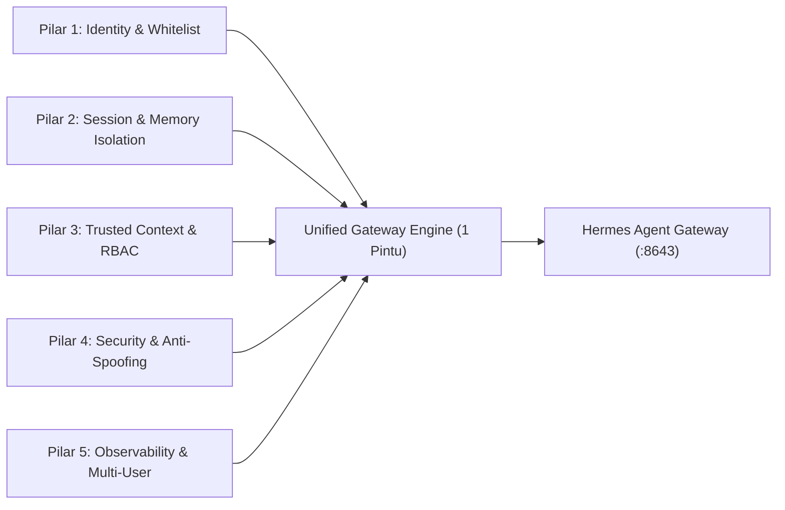
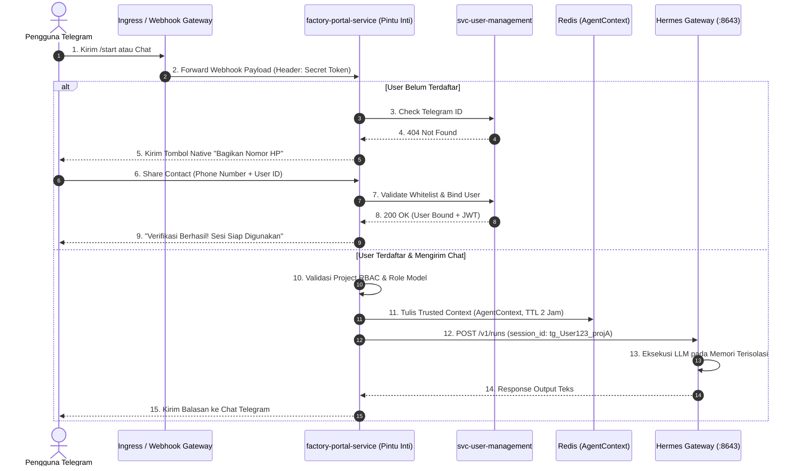
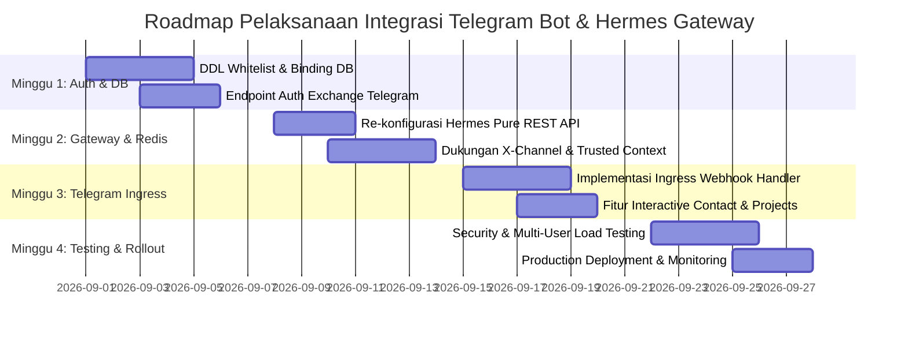

# Assessment Plan: Telegram Bot Integration with Hermes Gateway via Unified Backend Portal

> **Versi Dokumen:** 1.0.0  
> **Tanggal:** 31 Agustus 2026  
> **Status:** Draft Proposal / Initial Technical Assessment Plan  
> **Target Audience:** Engineering Leads, System Analysts, AI Engineers, Backend Developers, DevOps, & Security Teams  
> **Referensi:** [2026-08-27-telegram-bot-trusted-context-grilling.md](file:///c:/Users/eksad/OneDrive/Documents/GitHub/eksad-agentic-knowledge-merge/2026-08-27-telegram-bot-trusted-context-grilling.md), [HERMES_GATEWAY_API_CONTRACTS.md](file:///c:/Users/eksad/OneDrive/Documents/GitHub/eksad-agentic-knowledge-merge/HERMES_GATEWAY_API_CONTRACTS.md), [TSD_svc_user_management_v1.0.md](file:///c:/Users/eksad/OneDrive/Documents/GitHub/eksad-agentic-knowledge-merge/docs/tsd/TSD_svc_user_management_v1.0.md), [TELEGRAM_BOT_HERMES_MIDDLEWARE_SOLUTION.md](file:///c:/Users/eksad/OneDrive/Documents/GitHub/eksad-agentic-knowledge-merge/TELEGRAM_BOT_HERMES_MIDDLEWARE_SOLUTION.md)

---

## 📑 Daftar Isi
1. [Executive Summary (Ringkasan Eksekutif)](#1-executive-summary-ringkasan-eksekutif)
2. [Background & Problem Statement (Latar Belakang & Gap Analysis)](#2-background--problem-statement-latar-belakang--gap-analysis)
3. [Ruang Lingkup Asesmen & 5 Pilar Arsitektur](#3-ruang-lingkup-asesmen--5-pilar-arsitektur)
4. [Kebutuhan Tech Stack & Spesifikasi Komponen](#4-kebutuhan-tech-stack--spesifikasi-komponen)
5. [Maturity Level Assessment (Matriks Kematangan Sistem)](#5-maturity-level-assessment-matriks-kematangan-sistem)
6. [Kriteria Evaluasi Teknis & Metrik KPI](#6-kriteria-evaluasi-teknis--metrik-kpi)
7. [Risk Assessment & Mitigation Matrix (Matriks Risiko & Mitigasi)](#7-risk-assessment--mitigation-matrix-matriks-risiko--mitigasi)
8. [Kerangka Kerja Arsitektur (End-to-End Target Architecture)](#8-kerangka-kerja-arsitektur-end-to-end-target-architecture)
9. [Roadmap Implementasi & Rencana Eksekusi (4 Fase)](#9-roadmap-implementasi--rencana-eksekusi-4-fase)
10. [Actionable Deliverables & Readiness Checklist](#10-actionable-deliverables--readiness-checklist)
11. [Kesimpulan & Rekomendasi Awal](#11-kesimpulan--rekomendasi-awal)

---

## 1. Executive Summary (Ringkasan Eksekutif)

EKSAD Software Factory memperluas antarmuka interaksi AI Agent (System Analyst & Business Analyst) agar dapat diakses tidak hanya melalui **Web Portal**, tetapi juga secara **mandiri (*standalone*) melalui aplikasi Telegram**. 

Pengujian awal menggunakan integrasi langsung bawaan CLI (`./hermes gateway setup`) pada pod Kubernetes mengidentifikasi dua kendala kritis:
1. **Memory Collision (*Tumpang Tindih*)**: Riwayat obrolan antar-pengguna Telegram saling menimpa karena Hermes berjalan dalam mode *single-session context*.
2. **Ketiadaan Kontrol Akses & Trusted Context**: Bot terbuka untuk publik tanpa otentikasi whitelist, serta tidak memiliki izin *AgentContext* di Redis sehingga fitur commit GitLab dan penerbitan dokumen (*Artifacts*) gagal berfungsi.

**Tujuan Dokumen Asesmen Ini:**
1. Mengukur kesiapan teknis integrasi Telegram Bot ke dalam ekosistem **Unified Backend Gateway (`factory-portal-service`)** sebagai arsitektur **"1 Pintu"**.
2. Menetapkan standar registrasi mandiri via Telegram menggunakan verifikasi nomor telepon native (*anti-spoofing*) terhadap database whitelist (`svc-user-management`).
3. Memastikan pemisahan memori 100% (*Zero Context Bleed*) melalui alokasi `session_id` terisolasi di Hermes Gateway.
4. Menyusun rencana kerja terstruktur (Roadmap 4 Minggu) untuk implementasi, pengujian keamanan, dan *production deployment*.

---

## 2. Background & Problem Statement (Latar Belakang & Gap Analysis)

```text
KONDISI SAAT INI (AS-IS):
[ Telegram User A ] ──┐
                      ├──► [ Hermes Gateway Pod ] ──► ⚠️ 1 Sesi Global (Memory Tumpang Tindih)
[ Telegram User B ] ──┘    (Tanpa Auth & Whitelist)   ⚠️ Bypass Portal (GitLab & Artifact Mati)

TARGET SISTEM (TO-BE):
[ Web Browser ] ──────┐
                      ├──► [ 🚪 factory-portal-service ] ──► [ Hermes Gateway REST API ]
[ Telegram Bot ] ─────┘    • Whitelist Auth & JWT            • session_id: tg_UserA_proj1
  (Native Share Contact)   • Redis AgentContext (GitLab ON)  • session_id: tg_UserB_proj2
                           • RBAC Project Guard              ✅ MEMORY 100% TERISOLASI
```

### Tabel Analisis Kesenjangan (Gap Analysis)

| Aspek Arsitektur | Kondisi Saat Ini (*Current State*) | Kondisi Target (*Target State*) | Dampak Bisnis & Teknis |
|---|---|---|---|
| **Pintu Akses (Gateway)** | Dua jalur terpisah (Web via Portal, Telegram langsung ke Hermes). | **1 Pintu Terpadu** via `factory-portal-service`. | Menghilangkan duplikasi logika RBAC dan kebijakan keamanan. |
| **Isolasi Memori** | Saling tumpang tindih (*Context Bleed*). | **100% Terisolasi** per `(user_id, project_id, session_id)`. | Menjamin kerahasiaan data proyek antar karyawan. |
| **Otentikasi Telegram** | Terbuka publik tanpa login. | Registrasi via **Native Share Contact** + Whitelist Karyawan. | Mencegah akses ilegal dan pemborosan kuota token LLM. |
| **Trusted Context & GitLab** | Mati total (karena bypass Redis portal). | Aktif penuh (Portal menerbitkan *AgentContext* ke Redis). | Agent via Telegram dapat membaca repo & commit ke GitLab. |
| **Device Session Lock** | Konflik jika user membuka Web & Telegram bersamaan. | Terpisah via `X-Device-Id: tg_<tele_id>` & `X-Channel: TELEGRAM`. | Pengguna dapat bekerja secara omnichannel tanpa saling *kick*. |

---

## 3. Ruang Lingkup Asesmen & 5 Pilar Arsitektur

Asesmen ini mengevaluasi kesiapan sistem berdasarkan **5 Pilar Utama**:



### Pilar 1: Identity, Authentication & Whitelist Verification
- **Verifikasi Nomor Telepon Native**: Menggunakan fitur Telegram `request_contact=True` untuk memastikan keaslian nomor telepon langsung dari server Telegram (*anti-spoofing*).
- **Sinkronisasi Database**: Evaluasi skema database di `svc-user-management` (`tbl_employee_whitelist` dan `tbl_telegram_bindings`).
- **Penerbitan JWT**: Kemampuan sistem menukarkan identitas Telegram yang valid menjadi JWT Token standar EKSAD.

### Pilar 2: Session Scoping & Hermes Memory Isolation
- **Peniadaan Daemon Telegram Hermes**: Mematikan mode Telegram internal pada Hermes CLI dan beralih ke *Pure HTTP REST API*.
- **Formula Session ID**: Penerapan format sesi unik: `session_id = tg_{user_id}_{project_id}_{uuid}` pada setiap request `POST /v1/runs`.
- **Manajemen Sesi Mandiri**: Dukungan perintah `/newchat` untuk me-reset konteks tanpa menghapus riwayat akun pengguna.

### Pilar 3: Unified Gateway & Trusted Context Integration
- **Penerbitan AgentContext**: Memastikan `factory-portal-service` menulis kredensial izin percakapan ke Redis (TTL 2 jam) saat sesi Telegram aktif.
- **Dukungan GitLab SCM Tools**: Menguji apakah AI Agent yang dipanggil dari Telegram dapat menjalankan tool MCP GitLab secara lancar.
- **Dukungan Multi-Project**: Penyediaan perintah `/projects` berbasis inline keyboard agar pengguna dapat memilih proyek aktif.

### Pilar 4: Security, Privacy & Network Isolation
- **Verifikasi Webhook**: Memvalidasi header rahasia Telegram `X-Telegram-Bot-Api-Secret-Token` pada setiap request webhook masuk.
- **Isolasi Jaringan Kubernetes**: Memastikan pod Hermes Gateway (`:8643`) berada di private network cluster dan hanya dapat diakses oleh pod `factory-portal-service`.
- **Manajemen Kredensial**: Penyimpanan Bot Token dan API Key Hermes menggunakan Kubernetes Secrets.

### Pilar 5: Observability, Metrics & Concurrency
- **Multi-User Load Testing**: Pengujian 50+ request Telegram secara bersamaan untuk memastikan tidak ada antrean yang macet (*deadlock/blocking I/O*).
- **Pencatatan Audit Trail**: Logging aktivitas percakapan dengan label `channel: "TELEGRAM"` pada log sistem.

---

## 4. Kebutuhan Tech Stack & Spesifikasi Komponen

Berikut adalah spesifikasi teknologi yang dibutuhkan di setiap layer arsitektur:

```text
+---------------------------------------------------------------------------------------------------------+
|                                    ARSITEKTUR TECH STACK TERPADU                                        |
+-------------------+------------------------------------+------------------------------------------------+
| Layer Arsitektur  | Teknologi / Library Utama          | Fungsi & Peran Teknis                          |
+-------------------+------------------------------------+------------------------------------------------+
| Telegram Layer    | • Python 3.11+ / TypeScript        | Runtime asynchronous non-blocking              |
|                   | • python-telegram-bot v21+ / grammY| Library Bot API (Native Contact & Keyboards)   |
|                   | • httpx / axios                    | HTTP Client Async (Streaming & Pool Manager)   |
+-------------------+------------------------------------+------------------------------------------------+
| Unified Gateway   | • Java 17+ (Quarkus / Spring Boot) | Backend Core Gateway (1 Pintu Akses)           |
| (Portal Service)  | • SmallRye JWT / Spring Security   | Validasi JWT, RBAC Guard, Header X-Channel     |
|                   | • Redis 7.x (redis-py / Jedis)     | Trusted Context (AgentContextStore, TTL 2 Jam) |
+-------------------+------------------------------------+------------------------------------------------+
| Identity Layer    | • PostgreSQL 15+                   | Relational Database (Users & Whitelist)        |
| (User Management) | • Flyway Migration v10+            | Version control skema database DDL (V1.1.0)    |
|                   | • Keycloak / SmallRye JWT Auth     | Penerbitan JWT Token & Identity Provider       |
+-------------------+------------------------------------+------------------------------------------------+
| AI Agent Engine   | • Hermes Gateway (:8643 REST API)  | Inference Router & Tool Executor               |
| (Hermes Layer)    | • MiniMax-M2 / LLM Engine          | Model Analisis SA (System Analyst) & BA        |
|                   | • SQLite / Postgres Session Store  | Storage memori terisolasi per session_id       |
+-------------------+------------------------------------+------------------------------------------------+
| DevOps & Security | • Docker (Linux slim images)       | Containerization microservice                  |
|                   | • Kubernetes 1.28+                 | Container Orchestration (Pod, Secret, Service) |
|                   | • NGINX Ingress Controller         | Reverse Proxy Webhook (HTTPS SSL Termination)  |
|                   | • k6 / Locust                      | Performance & Concurrency Load Testing Tool    |
+-------------------+------------------------------------+------------------------------------------------+
```

### Rincian Dependensi & Komponen Kunci:

1. **Telegram Ingress Module (`requirements.txt`)**:
   ```text
   python-telegram-bot[job-queue]==21.5   # Telegram Bot Framework (Async/Await)
   httpx==0.27.2                          # Async HTTP Client untuk koneksi ke Portal & Hermes
   redis==5.0.8                           # Distributed caching untuk session mapper
   pydantic==2.8.2                        # Skema validasi data payload API
   pydantic-settings==2.4.0               # Type-safe parsing Environment Variable K8s
   fastapi==0.112.2                       # Webhook endpoint & Kubernetes Health Probe
   uvicorn==0.30.6                        # ASGI Server performa tinggi
   ```

2. **Backend Gateway & User Management Modules (Java Maven / Gradle)**:
   - `quarkus-resteasy-reactive-jackson` / `spring-boot-starter-web`
   - `quarkus-smallrye-jwt` / `spring-boot-starter-oauth2-resource-server`
   - `quarkus-redis-client` / `spring-boot-starter-data-redis`
   - `quarkus-flyway` / `flyway-core` + `postgresql`

---

## 5. Maturity Level Assessment (Matriks Kematangan Sistem)

Evaluasi tingkat kematangan arsitektur integrasi Telegram saat ini terhadap target:

| Dimensi Evaluasi | Level 1: Ad-Hoc (Saat Ini) | Level 2: Controlled (Fase 1-2) | Level 3: Unified Gateway (Target) | Level 4: Enterprise Omnichannel |
|---|---|---|---|---|
| **Otentikasi User** | Tanpa otentikasi (Publik). | Verifikasi manual / OTP teks. | **Native Share Contact + DB Whitelist**. | SSO Terpadu + Biometric Verification. |
| **Isolasi Memori** | 1 Sesi Global (Tercampur). | Session ID manual per chat ID. | **Session Scoping per User & Project**. | Dynamic Hybrid Memory + Context Pruning. |
| **Integrasi Portal** | Bypass Portal (Terpisah). | Bot memanggil API chat adapter. | **1 Pintu via `factory-portal-service`**. | Full Sync Real-time Web & Mobile UI. |
| **Trusted Context** | Tidak ada (GitLab Mati). | Token statis hardcoded. | **Redis AgentContext (2 Jam TTL)**. | Fine-grained ABAC + Dynamic Policy Engine. |
| **Infrastruktur K8s** | Setup CLI dalam pod. | Polling bot container terpisah. | **Webhook Ingress + NetworkPolicy**. | Auto-scaling Pods + Multi-Region HPA. |

> [!NOTE]
> **Status Proyek:** Saat ini berada pada **Level 1**. Target penyelesaian asesmen dan implementasi ini adalah mencapai **Level 3**.

---

## 6. Kriteria Evaluasi Teknis & Metrik KPI

| ID Metrik | Parameter Kunci | Target Standar | Metode Pengujian |
|---|---|---|---|
| **KPI-01** | **Context Bleed Rate** | **0% (Nol Pelanggaran)** | Dua user bertanya topik rahasia berbeda secara simultan; verifikasi isi memori DB Hermes. |
| **KPI-02** | **Auth & Whitelist Latency** | **< 150 ms** | Waktu pemrosesan dari user klik *Share Contact* hingga JWT terbit. |
| **KPI-03** | **Time to First Token (TTFT)** | **< 2.5 Detik** | Waktu tunggu dari user kirim chat Telegram hingga respons awal diterima. |
| **KPI-04** | **Concurrency Throughput** | **50+ Concurrent Users** | Stress testing webhook dengan Locust / k6 tanpa ada request yang drop (*0% 5xx error*). |
| **KPI-05** | **Anti-Spoofing Accuracy** | **100%** | Uji coba forward kontak orang lain; bot wajib menolak jika `contact.user_id != sender.id`. |

---

## 7. Risk Assessment & Mitigation Matrix (Matriks Risiko & Mitigasi)

| ID Risiko | Deskripsi Risiko | Severity | Dampak | Rencana Mitigasi Teknis |
|---|---|---|---|---|
| **R-01** | **Memory Collision / Data Leak**: Jawaban AI untuk User B memuat data proyek User A. | **CRITICAL** | Kebocoran rahasia bisnis klien & pelanggaran privasi. | Wajibkan pembuatan `session_id` unik berbasis UUID di Hermes per sesi pengguna. |
| **R-02** | **Phone Number Spoofing**: Pengguna memasukkan nomor HP karyawan lain secara manual. | **HIGH** | Akses ilegal atas nama akun orang lain. | Tolak input teks manual; wajibkan tombol native Telegram `request_contact=True`. |
| **R-03** | **Device Lock Conflict**: User di-logout dari Web Portal saat membuka Telegram. | **HIGH** | Pengalaman pengguna rusak (*UX degradation*). | Perbarui `DeviceSessionGuard` agar membedakan device ID Web (`web_*`) dan Telegram (`tg_*`). |
| **R-04** | **GitLab Tool Failure**: AI Agent gagal melakukan commit/baca repo GitLab via Telegram. | **HIGH** | Fitur engineering agent tidak berfungsi. | Integrasikan flow melalui `factory-portal-service` agar *AgentContext* Redis selalu terbit. |
| **R-05** | **Fake Webhook Injection**: Penyerang mengirim payload palsu ke endpoint webhook portal. | **CRITICAL** | Bypass otentikasi sistem. | Pasang verifikasi header rahasia `X-Telegram-Bot-Api-Secret-Token` pada ingress portal. |

---

## 8. Kerangka Kerja Arsitektur (End-to-End Target Architecture)

### 8.1 Alur Logis Integrasi 1 Pintu (Sequence Diagram)



---

## 9. Roadmap Implementasi & Rencana Eksekusi (4 Fase)

Pelaksanaan proyek integrasi ini dirancang selesai dalam **4 Minggu (1 Bulan)**:



### Rincian Target Kerja per Minggu:

#### Minggu 1: Modul Identitas & Database (`svc-user-management`)
- [ ] Buat skrip migrasi Flyway `V1.1.0__add_telegram_and_phone_support.sql`.
- [ ] Buat endpoint `GET /api/v1/auth/telegram/check` dan `POST /api/v1/auth/telegram/exchange`.
- [ ] Isi data awal (*seed data*) nomor HP karyawan ke tabel `tbl_employee_whitelist`.

#### Minggu 2: Modul Gateway & Trusted Context (`factory-portal-service` & Hermes)
- [ ] Ubah konfigurasi pod Hermes Gateway di Kubernetes agar murni menjalankan HTTP API (`:8643`).
- [ ] Perbarui `DeviceSessionGuard` di backend portal untuk mendukung `X-Channel: TELEGRAM` dan device ID `tg_*`.
- [ ] Pastikan *AgentContext* ditulis ke Redis untuk sesi percakapan Telegram.

#### Minggu 3: Modul Antarmuka Telegram (*Telegram Ingress Controller*)
- [ ] Daftarkan webhook Telegram ke URL Ingress Portal dengan proteksi `secret_token`.
- [ ] Implementasikan alur tombol *Share Contact* native Telegram untuk registrasi otomatis.
- [ ] Implementasikan perintah navigasi bot: `/start`, `/projects`, `/newchat`, `/status`, `/help`.

#### Minggu 4: Pengujian Keamanan, Beban & Peluncuran (*Production Rollout*)
- [ ] Jalankan pengujian penetrasi: manipulasi nomor HP, forward kontak palsu, dan request tanpa token webhook.
- [ ] Jalankan pengujian multi-user simultan (50 user) untuk memvalidasi *Context Bleed = 0%*.
- [ ] Deploy ke Kubernetes Production dan aktifkan monitoring log error.

---

## 10. Actionable Deliverables & Readiness Checklist

Untuk menyelesaikan asesmen dan implementasi ini, tim teknis wajib menyelesaikan artefak berikut:

### Checklist Kesiapan Teknis (*Readiness Checklist*):
- [ ] **1. DDL Migration Script:** Skrip Flyway SQL untuk tabel whitelist dan binding Telegram telah teruji di staging database.
- [ ] **2. Hermes Pure API Configuration:** Pod Hermes Gateway di K8s dipastikan tidak lagi menjalankan runner Telegram internal.
- [ ] **3. Unified Gateway Controller:** Endpoint webhook Telegram di `factory-portal-service` siap menerima dan memvalidasi request.
- [ ] **4. BotFather Profile:** Bot Telegram memiliki deskripsi, token aman di K8s Secret, dan daftar menu command terdaftar.
- [ ] **5. Test Report Sign-Off:** Laporan pengujian menyatakan **0% Memory Leak/Tumpang Tindih** pada pengujian multi-user.

---

## 11. Kesimpulan & Rekomendasi Awal

Pendekatan **"1 Pintu" via `factory-portal-service`** adalah solusi paling aman, kokoh, dan terstandarisasi untuk menghubungkan Telegram Bot dengan Hermes Gateway. Solusi ini secara tuntas menyelesaikan masalah *memory tumpang tindih*, menutup celah akses publik ilegal melalui verifikasi whitelist nomor telepon, serta memastikan integrasi ke GitLab dan penyimpanan dokumen tetap berjalan normal.

**Langkah Pertama yang Direkomendasikan:**
1. Mengesahkan dokumen asesmen ini bersama Technical Lead & Tim Backend.
2. Memulai pengerjaan **Minggu 1** dengan menambahkan skema database whitelist pada `svc-user-management`.
3. Memastikan tim DevOps menyiapkan secret token Telegram di cluster Kubernetes staging.

