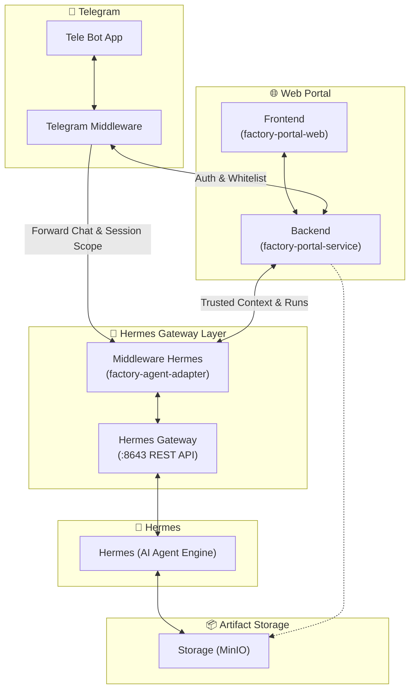

# 📋 Simple Assessment & Task Breakdown: Integrasi Telegram Bot Hermes Gateway (1 Pintu)

> **Dokumen:** Assessment Ringkas & Panduan Eksekusi Tugas  
> **Versi:** 1.0.0 (Simplified & Action-Oriented)  
> **Target:** Developer / Engineer Pelaksana  
> **Status:** Siap Eksekusi  

---

## 🎯 1. Ringkasan Proyek & Tujuan

Mengubah Telegram Bot yang sebelumnya terhubung langsung via Hermes CLI (yang menyebabkan **chat publik tanpa izin** dan **memori saling tumpang tindih**) menjadi:
1. **Akses Terbatas (Whitelist)**: Hanya nomor HP yang terdaftar di database karyawan yang bisa memakai bot.
2. **Standalone UX di Telegram**: Registrasi langsung via tombol *Share Contact* native Telegram tanpa wajib login ke web portal.
3. **Arsitektur 1 Pintu**: Telegram Bot masuk melalui Backend Portal (`factory-portal-service`), sehingga *Trusted Context* (Redis) aktif dan AI Agent bisa commit ke GitLab.
4. **Isolasi Memori 100%**: Hermes menerima `session_id` unik untuk tiap user & proyek sehingga memori tidak akan pernah tertukar/tertimpa.

---

## 🏗️ 2. Arsitektur Sistem (High-Level Design)

Berdasarkan blueprint arsitektur yang dirancang:

### 🧩 Deskripsi Komponen & Peran:

1. **Telegram Layer (`Tele Bot App` & `Middleware`)**:
   - **`Tele Bot App`**: Menangani interaksi pengguna di Telegram (command `/start`, `/newchat`, `/projects`, inline buttons, dan tombol native *Share Contact*).
   - **`Middleware`**: Menjembatani bot dengan backend, memvalidasi otentikasi user, serta mem-forward request chat ke `factory-agent-adapter` dengan membawa metadata sesi yang aman.

2. **Web Portal (`factory-portal-web` [FE] & `factory-portal-service` [BE])**:
   - **`Frontend (factory-portal-web)`**: UI Web Portal untuk manajemen proyek, user, dan pemantauan AI.
   - **`Backend (factory-portal-service)`**: Core API & User Management untuk validasi whitelist, RBAC proyek, manajemen token/JWT, dan penyedia context ke Hermes.

3. **Hermes Gateway Layer (`factory-agent-adapter` & `Hermes Gateway`)**:
   - **`Middleware Hermes (factory-agent-adapter)`**: Lapisan perantara / adapter untuk memvalidasi otorisasi request (dari Portal / Telegram), mengelola isolasi *session scope*, dan meneruskan payload ke API Gateway.
   - **`Hermes Gateway`**: REST API Gateway resmi yang mengekspos endpoint pemanggilan LLM/Agent (`POST /v1/runs`, `/sessions`, health checks).

4. **Hermes (Core Engine)**:
   - Engine AI Agent murni yang menjalankan eksekusi tugas, skills, dan reasoning tanpa terhubung langsung ke chat publik Telegram.

5. **Artifact Storage (`MinIO`)**:
   - Object Storage S3-compatible tersentralisasi untuk menyimpan berkas keluaran AI (dokumen hasil generate, artifact, file analisa, dan log) yang dapat dibaca/ditulis oleh Hermes dan Web Portal.

---

## 🛠️ 3. Tech Stack yang Dibutuhkan

| Layer | Teknologi / Library | Alasan & Fungsi |
|---|---|---|
| **Bot / Ingress** | **Python 3.11+** + `python-telegram-bot` (v21 Async) | Menangani webhook Telegram, tombol native *Share Contact*, dan inline keyboard. |
| **HTTP Client** | **`httpx`** (Async) | Memanggil backend portal dan Hermes secara non-blocking (tidak membuat bot macet saat LLM mikir). |
| **Gateway / Core**| **Java 17+** (Quarkus / Spring Boot) di `factory-portal-service` | Pintu utama: validasi RBAC proyek, pemetaan user, dan penulisan izin ke Redis. |
| **State Cache** | **Redis 7.x** | Menyimpan *Trusted Context* (2 jam) dan mapping sesi user aktif. |
| **Identity DB** | **PostgreSQL 15+** + Flyway Migration | Menyimpan tabel whitelist karyawan & binding Telegram ID. |
| **AI Engine & Gateway** | **Hermes Gateway REST API** (`:8643`) | Engine LLM murni via endpoint `POST /v1/runs` + Middleware Hermes. |
| **Artifact Storage** | **MinIO** (S3 Compatible) | Menyimpan dokumen, artefak, dan file hasil generate AI. |
| **Infrastruktur** | **Docker** + **Kubernetes** + NGINX Ingress | Deployment container, manajemen Secret token, dan reverse proxy HTTPS. |

---

## 📝 4. Breakdown Task yang Harus Dilakukan

*(Bagian ini dikosongkan terlebih dahulu dan akan ditambahkan secara bertahap)*

---

## ⏱️ 5. Estimasi Total Durasi & Urutan Pengerjaan

*(Akan disesuaikan setelah rincian task ditambahkan)*

---

## 📌 6. Ringkasan Singkat yang Perlu Diingat

1. **Jangan biarkan Hermes CLI memegang Bot Telegram langsung** $\rightarrow$ Pisahkan ke layer middleware/portal.
2. **Gunakan `request_contact=True`** $\rightarrow$ Anti-spoofing nomor HP.
3. **Selalu sertakan `session_id` unik pada setiap `POST /v1/runs` ke Hermes** $\rightarrow$ Memori tidak akan pernah tumpang tindih.
4. **Gunakan `X-Device-Id: tg_<id>`** $\rightarrow$ User bisa buka Web Portal dan Telegram bersamaan tanpa saling *kick*.
5. **Simpan hasil keluaran & artefak di MinIO** $\rightarrow$ Tersentralisasi dan dapat diakses baik oleh Web Portal maupun bot.
