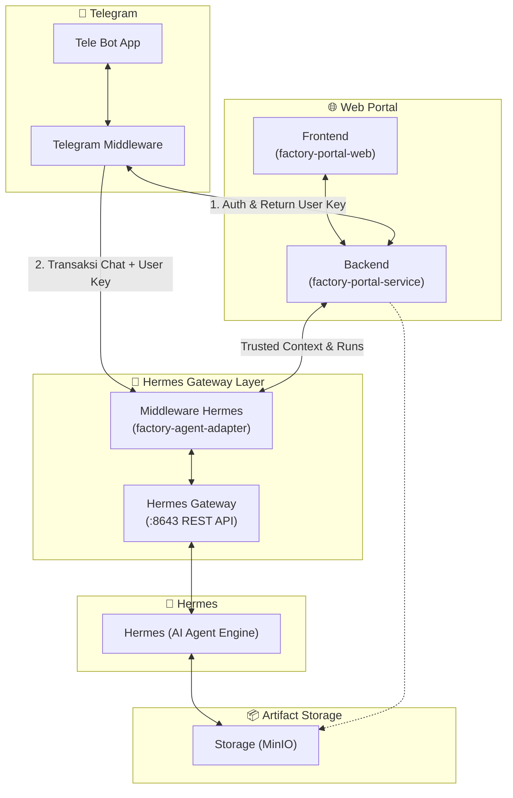

# 📋 Simple Assessment & Task Breakdown: Integrasi Telegram Bot Hermes Gateway (1 Pintu)

> **Dokumen:** Assessment Ringkas & Panduan Eksekusi Tugas  
> **Versi:** 1.0.0 (Simplified & Action-Oriented)  
> **Target:** Developer / Engineer Pelaksana  
> **Status:** Siap Eksekusi  

---

## 🎯 1. Ringkasan Proyek & Tujuan

Mengubah Telegram Bot yang sebelumnya terhubung langsung via Hermes CLI (yang menyebabkan **chat publik tanpa izin** dan **memori saling tumpang tindih**) menjadi:
1. **Akses Terbatas (Whitelist)**: Hanya nomor HP yang terdaftar di database karyawan yang bisa memakai bot.
2. **Standalone UX di Telegram**: Registrasi langsung via tombol *Share Contact* native Telegram tanpa wajib login ke web portal.
3. **Arsitektur 1 Pintu**: Telegram Bot masuk melalui Backend Portal (`factory-portal-service`), sehingga *Trusted Context* (Redis) aktif dan AI Agent bisa commit ke GitLab.
4. **Isolasi Memori 100%**: Hermes menerima `session_id` unik untuk tiap user & proyek sehingga memori tidak akan pernah tertukar/tertimpa.

---

## 🏗️ 2. Arsitektur Sistem (High-Level Design)

Berdasarkan blueprint arsitektur yang dirancang:

### 🧩 Deskripsi Komponen & Peran:

1. **Telegram Layer (`Tele Bot App` & `Telegram Middleware`)**:
   - **`Tele Bot App`**: Menangani interaksi pengguna di Telegram (command `/start`, `/newchat`, `/projects`, inline buttons, dan tombol native *Share Contact*).
   - **`Telegram Middleware`**: 
     - Melakukan proses autentikasi awal ke **`factory-portal-service` (Backend)** untuk validasi whitelist user dan mendapatkan **User Key** (kunci user / session token).
     - **Hanya setelah User Key berhasil didapatkan**, Telegram Middleware diizinkan melakukan transaksi chat/eksekusi prompt ke **`factory-agent-adapter` (Middleware Hermes)** dengan menyertakan User Key dan *session scope* yang valid.

2. **Web Portal (`factory-portal-web` [FE] & `factory-portal-service` [BE])**:
   - **`Frontend (factory-portal-web)`**: UI Web Portal untuk manajemen proyek, user, dan pemantauan AI.
   - **`Backend (factory-portal-service)`**: Pintu autentikasi utama, validasi whitelist nomor HP, mengembalikan **User Key**, RBAC proyek, manajemen JWT, serta mengelola penulisan izin ke cache context.

3. **Hermes Gateway Layer (`factory-agent-adapter` & `Hermes Gateway`)**:
   - **`Middleware Hermes (factory-agent-adapter)`**: Menerima request transaksi chat yang membawa **User Key** yang sah dari Telegram Middleware maupun Web Portal, memvalidasi otorisasi & context scope, lalu mem-forward payload ke REST API Hermes Gateway.
   - **`Hermes Gateway`**: REST API Gateway resmi yang mengekspos endpoint pemanggilan LLM/Agent (`POST /v1/runs`, `/sessions`, health checks).

4. **Hermes (Core Engine)**:
   - Engine AI Agent murni yang menjalankan eksekusi tugas, skills, dan reasoning tanpa terhubung langsung ke chat publik Telegram.

5. **Artifact Storage (`MinIO`)**:
   - Object Storage S3-compatible tersentralisasi untuk menyimpan berkas keluaran AI (dokumen hasil generate, artifact, file analisa, dan log) yang dapat dibaca/ditulis oleh Hermes dan Web Portal.

---

## 🛠️ 3. Tech Stack yang Dibutuhkan

| Layer | Teknologi / Library | Alasan & Fungsi |
|---|---|---|
| **Bot / Ingress** | **Python 3.11+** + `python-telegram-bot` (v21 Async) | Menangani webhook Telegram, tombol native *Share Contact*, dan inline keyboard. |
| **HTTP Client** | **`httpx`** (Async) | Memanggil backend portal dan Hermes secara non-blocking (tidak membuat bot macet saat LLM mikir). |
| **Gateway / Core**| **Java 17+** (Quarkus / Spring Boot) di `factory-portal-service` | Pintu utama: validasi RBAC proyek, pemetaan user, dan penulisan izin ke Redis. |
| **State Cache** | **Redis 7.x** | Menyimpan *Trusted Context* (2 jam) dan mapping sesi user aktif. |
| **Identity DB** | **PostgreSQL 15+** + Flyway Migration | Menyimpan tabel whitelist karyawan & binding Telegram ID. |
| **AI Engine & Gateway** | **Hermes Gateway REST API** (`:8643`) | Engine LLM murni via endpoint `POST /v1/runs` + Middleware Hermes. |
| **Artifact Storage** | **MinIO** (S3 Compatible) | Menyimpan dokumen, artefak, dan file hasil generate AI. |
| **Infrastruktur** | **Docker** + **Kubernetes** + NGINX Ingress | Deployment container, manajemen Secret token, dan reverse proxy HTTPS. |

---

## 📝 4. Breakdown Task yang Harus Dilakukan

### Task 1: Setup Telegram Middleware, Koneksi Bot, & Project Selection Flow
* **Objective**: Menginisialisasi service Telegram Middleware yang terhubung ke platform Telegram, mengintegrasikan alur autentikasi user untuk mendapatkan **User Key** dari Backend (`factory-portal-service`), serta mengimplementasikan fitur load dan pemilihan active project (`/projects` & `/project-active-<id>`).
* **Estimasi Durasi**: `1 - 2 Hari`
* **Yang Harus Dikerjakan**:
  1. **Koneksi Bot & Telegram Middleware**:
     - Setup service Telegram Middleware menggunakan `python-telegram-bot` (Async).
     - Sambungkan bot token resmi dan pastikan bot dapat menerima event/pesan dari Telegram.
  2. **Autentikasi & Pengambilan User Key**:
     - Handler verifikasi user (via `/start` & Share Contact).
     - Panggil endpoint autentikasi Backend (`factory-portal-service`) untuk validasi whitelist nomor HP / Telegram ID.
     - Simpan **User Key** yang dikembalikan oleh Backend sebagai kredensial valid untuk transaksi berikutnya.
  3. **Load Daftar Proyek (`/projects`)**:
     - Buat command handler `/projects`.
     - Request daftar proyek yang diizinkan untuk user tersebut ke Backend (`factory-portal-service`) menggunakan User Key.
     - Tampilkan list proyek berpenomoran (misalnya nomor 1 s.d. 10) beserta instruksi pemilihan.
  4. **Pilih Proyek Aktif (`/project-active-<nomor>` / Command Selector)**:
     - Buat handler pemilihan proyek (contoh: user mengetik `/project-active-1` atau menekan tombol proyek 1).
     - Set konteks `active_project_id` di cache/session state pengguna.
     - Kirim konfirmasi ke user bahwa proyek aktif telah berhasil diset dan siap untuk bertransaksi dengan AI Agent.
* **Potential Obstacle (Kendala)**:
  - *Kendala*: User mencoba menjalankan `/projects` atau `/project-active-<id>` sebelum melakukan autentikasi / belum memiliki User Key yang valid.
  - *Solusi*: Berikan middleware validation guard. Jika `User Key` belum ada di session cache, arahkan user secara otomatis untuk `/start` dan membagikan kontak terlebih dahulu.
* **Definition of Done (DoD)**:
  - Service Telegram Middleware aktif dan tersambung ke Telegram.
  - User yang terverifikasi berhasil mendapatkan User Key dari Backend (`factory-portal-service`).
  - Command `/projects` sukses menampilkan daftar proyek dari Backend, dan command `/project-active-<id>` berhasil menyetel proyek aktif pengguna.

---

### Task 2: Payload Serialization (String to JSON Body), Komunikasi ke Middleware Hermes (`factory-agent-adapter`), & Session Management
* **Objective**: Mengimplementasikan logika transformasi pesan teks Telegram menjadi payload body JSON valid yang mengikutsertakan **User Key** & context proyek, mengirimkannya ke `factory-agent-adapter` (Middleware Hermes), menangani respon hasil generate AI, serta mengelola auto-save session dan standarisasi penamaan `session_id` yang kompatibel dengan backend.
* **Estimasi Durasi**: `2 - 3 Hari`
* **Yang Harus Dikerjakan**:
  1. **String Manipulation & JSON Body Builder**:
     - Menangkap input prompt/chat teks dari user di Telegram.
     - Memanipulasi dan memformat string tersebut ke dalam JSON Request Body sesuai kontrak API `factory-agent-adapter`.
     - Menyematkan metadata autentikasi: **User Key**, `project_id` aktif, role AI (misal: `system-analyst` / `business-analyst`), dan `session_id`.
  2. **Komunikasi Asinkronus ke `factory-agent-adapter`**:
     - Mengirim request HTTP POST menggunakan `httpx` (Async Client) ke endpoint run `factory-agent-adapter`.
     - Memberikan feedback visual *typing action* (`send_chat_action("typing")`) ke user Telegram selama proses generate berlangsung agar user mengetahui AI sedang berpikir.
  3. **Handling Respon AI & Chunking**:
     - Menerima hasil respon/generate dari `factory-agent-adapter` (teks analisis, markdown, atau ringkasan dokumen).
     - Memformat output pesan ke format Telegram MarkdownV2/HTML yang rapi.
     - Mengimplementasikan text chunking jika respon teks melebihi batas 4.096 karakter Telegram.
  4. **Auto-Save Session & Penyelarasan Format `session_id`**:
     - Mengaktifkan fitur penyimpanan sesi secara otomatis (`auto-save session`) setelah eksekusi generate berhasil.
     - Menyelaraskan konvensi penamaan format `session_id` dengan Backend (`factory-portal-service`), misalnya:
       `tg_{user_id}_{project_id}_{session_uuid}`
       agar memori percakapan terisolasi penuh, tidak tertukar antar-proyek/user, dan mudah ditelusuri di Redis & database.
* **Potential Obstacle (Kendala)**:
  - *Kendala*: Format penamaan `session_id` tidak seragam antara Telegram Bot dan Web Portal, atau request timeout saat LLM memproses data yang sangat besar.
  - *Solusi*: Sepakati struktur prefix `session_id` yang standar dengan tim backend, serta terapkan timeout konfigurasi yang cukup (misal 60-120 detik) pada HTTP Client `httpx`.
* **Definition of Done (DoD)**:
  - Input string pengguna berhasil diubah menjadi JSON body yang valid dan diterima oleh `factory-agent-adapter`.
  - Respon hasil generate AI Agent berhasil tampil di chat Telegram pengguna secara utuh.
  - Sesi obrolan tersimpan otomatis dengan format penamaan `session_id` yang sesuai standar backend.

---

## ⏱️ 5. Estimasi Total Durasi & Urutan Pengerjaan

*(Akan disesuaikan seiring penambahan task berikutnya)*

---

## 📌 6. Ringkasan Singkat yang Perlu Diingat

1. **Jangan biarkan Hermes CLI memegang Bot Telegram langsung** $\rightarrow$ Pisahkan ke layer middleware/portal.
2. **Autentikasi ke Backend terlebih dahulu** $\rightarrow$ Dapatkan `User Key` sebelum mengizinkan transaksi chat ke `factory-agent-adapter` (Middleware Hermes).
3. **Gunakan `request_contact=True`** $\rightarrow$ Anti-spoofing nomor HP.
4. **Selalu sertakan `session_id` unik pada setiap `POST /v1/runs` ke Hermes** $\rightarrow$ Memori tidak akan pernah tumpang tindih.
5. **Gunakan `X-Device-Id: tg_<id>`** $\rightarrow$ User bisa buka Web Portal dan Telegram bersamaan tanpa saling *kick*.
6. **Simpan hasil keluaran & artefak di MinIO** $\rightarrow$ Tersentralisasi dan dapat diakses baik oleh Web Portal maupun bot.
