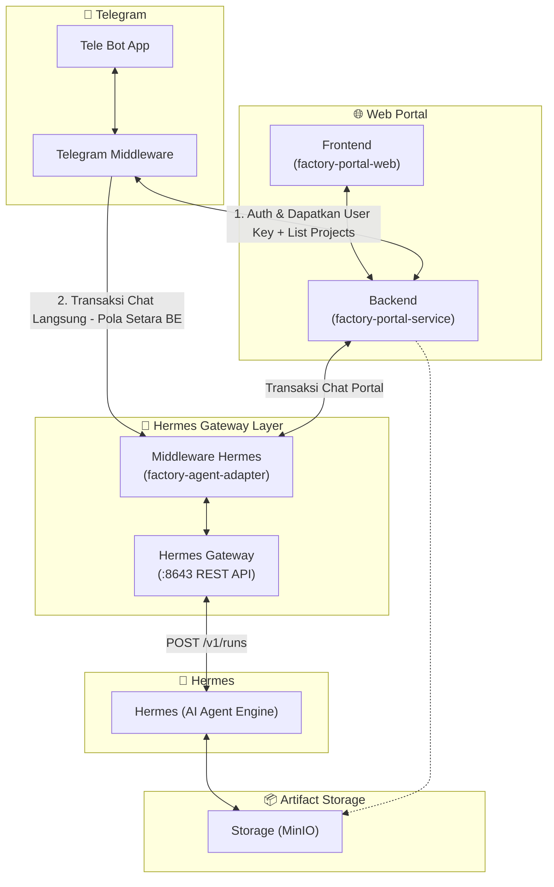

# 📋 Simple Assessment & Task Breakdown: Integrasi Telegram Bot Hermes Gateway (1 Pintu)

> **Dokumen:** Assessment Ringkas & Panduan Eksekusi Tugas  
> **Versi:** 1.0.0 (Simplified & Action-Oriented)  
> **Target:** Developer / Engineer Pelaksana  
> **Status:** Siap Eksekusi  

---

## 🎯 1. Ringkasan Proyek & Tujuan

Mengubah integrasi Telegram Bot dari yang sebelumnya terhubung langsung via Hermes CLI (menyebabkan **chat publik tanpa izin** dan **memori saling tumpang tindih**) menjadi:
1. **Akses Terbatas (Whitelist)**: Hanya nomor HP yang terdaftar di database karyawan yang bisa memakai bot.
2. **Standalone UX di Telegram**: Registrasi langsung via tombol *Share Contact* native Telegram tanpa wajib login ke web portal.
3. **Komunikasi Langsung & Terstandarisasi ke Adapter**: Telegram Middleware langsung berkomunikasi ke `factory-agent-adapter` (Middleware Hermes) menggunakan pola dan standar kontrak API yang sama persis seperti yang digunakan oleh Backend Portal.
4. **Isolasi Memori 100%**: Sesi percakapan di-generate langsung oleh upstream (`factory-agent-adapter` / Hermes) sehingga memori tidak akan pernah tertukar atau tertimpa.

---

## 🏗️ 2. Arsitektur Sistem (High-Level Design)

Berdasarkan blueprint arsitektur yang dirancang:



### 🧩 Deskripsi Komponen & Peran:

1. **Telegram Layer (`Tele Bot App` & `Telegram Middleware`)**:
   - **`Tele Bot App`**: Antarmuka bot Telegram pengguna (command `/start`, `/projects`, `/project-active-<id>`, chat teks, dan tombol native *Share Contact*).
   - **`Telegram Middleware`**: 
     - **Auth & Metadata**: Memanggil **`factory-portal-service` (Backend)** untuk validasi whitelist nomor HP, mendapatkan **User Key** (JWT Token), dan mengambil daftar proyek (`/projects`).
     - **Transaksi Chat Mandiri**: Setelah mengantongi User Key dan Proyek Aktif, Telegram Middleware **langsung menembak ke `factory-agent-adapter`** (`POST /channel/sessions`, `POST /channel/sessions/{id}/messages`, dan streaming SSE) dengan cara kerja dan kontrak request yang setara dengan Backend Portal.

2. **Web Portal (`factory-portal-web` [FE] & `factory-portal-service` [BE])**:
   - **`Frontend (factory-portal-web)`**: UI Web Portal untuk pengguna web (manajemen proyek, monitoring, dsb.).
   - **`Backend (factory-portal-service)`**: Pusat otentikasi identitas, validasi whitelist nomor HP, manajemen RBAC proyek, penyedia token/User Key, dan penyedia context store.

3. **Hermes Gateway Layer (`factory-agent-adapter` & `Hermes Gateway`)**:
   - **`Middleware Hermes (factory-agent-adapter)`**: 
     - Pusat standar komunikasi (single gateway adapter) yang melayani request percakapan baik dari Web Portal maupun Telegram Middleware.
     - Mengelola sesi upstream (`/channel/sessions`), device lock (`X-Device-Id`), idempotency, dan **menerjemahkan request pesan menjadi pemanggilan Hermes Gateway `POST /v1/runs`**.
   - **`Hermes Gateway`**: REST API Gateway resmi (`:8643`) yang menjalankan eksekusi AI Agent via **`POST /v1/runs`** dan event stream.

4. **Hermes (Core Engine)**:
   - Engine AI Agent murni yang menjalankan reasoning, tools, dan eksekusi prompt secara stateless.

5. **Artifact Storage (`MinIO`)**:
   - Object Storage S3-compatible tersentralisasi untuk menyimpan file keluaran/dokumen AI yang dapat diakses oleh Hermes dan Web Portal.

---

## 🛠️ 3. Tech Stack yang Dibutuhkan

| Layer | Teknologi / Library | Alasan & Fungsi |
|---|---|---|
| **Bot / Ingress** | **Python 3.11+** + `python-telegram-bot` (v21 Async) | Menangani webhook Telegram, tombol native *Share Contact*, dan inline keyboard. |
| **HTTP Client** | **`httpx`** (Async) | Memanggil backend portal dan Hermes secara non-blocking (tidak membuat bot macet saat LLM mikir). |
| **Gateway / Core**| **Java 17+** (Quarkus / Spring Boot) di `factory-portal-service` | Pintu utama: validasi RBAC proyek, pemetaan user, dan penulisan izin ke Redis. |
| **State Cache** | **Redis 7.x** | Menyimpan *Trusted Context* (2 jam) dan mapping sesi user aktif. |
| **Identity DB** | **PostgreSQL 15+** + Flyway Migration | Menyimpan tabel whitelist karyawan & binding Telegram ID. |
| **AI Engine & Gateway** | **Hermes Gateway REST API** (`:8643`) | Engine LLM murni via endpoint `POST /v1/runs` + Middleware Hermes. |
| **Artifact Storage** | **MinIO** (S3 Compatible) | Menyimpan dokumen, artefak, dan file hasil generate AI. |
| **Infrastruktur** | **Docker** + **Kubernetes** + NGINX Ingress | Deployment container, manajemen Secret token, dan reverse proxy HTTPS. |

---

## 📝 4. Breakdown Task yang Harus Dilakukan

### Task 1: Setup Akun Bot di BotFather (`@BotFather`), Menu Perintah, & Koneksi ke Telegram Middleware
* **Prerequisites (Syarat Sebelum Memulai)**:
  - Akun Telegram aktif (untuk mengakses `@BotFather`).
  - Runtime Python 3.11+ dan library `python-telegram-bot` (v21 Async).
  - Nama resmi dan username bot yang disepakati (misal `@EksadBusinessAnalystBot` atau `@EksadSystemAnalystBot`).
  - Konfigurasi peran agen (`AGENT_ROLE=BUSINESS_ANALYST` atau `SYSTEM_ANALYST`) pada environment variable middleware (**Prinsip: 1 Bot Telegram = Dedicated 1 Agent Role**).
  - Akses jaringan internet untuk menghubungi Telegram Bot API (`https://api.telegram.org`).
* **Objective**: Mendaftarkan bot resmi di platform Telegram via `@BotFather`, mendapatkan Bot API Token, mendaftarkan menu perintah (commands) navigasi lengkap, serta menetapkan arsitektur konektivitas (Long-Polling / Webhook) agar Telegram Middleware dapat menerima event dan pesan dari Telegram secara realtime.
* **Estimasi Durasi**: `2 - 4 Jam`
* **Yang Harus Dikerjakan**:
  1. **Registrasi Bot & Pengamanan Token**:
     - Buka `@BotFather` di Telegram, jalankan `/newbot` untuk membuat bot baru.
     - Simpan Bot Token (format `123456:ABC-DEF...`) dengan aman ke dalam file environment / Kubernetes Secret (`telegram-bot-secret`).
  2. **Pendaftaran Menu Perintah Navigasi (`/setcommands`)**:
     - Daftarkan list perintah standar di BotFather:
       ```text
       start - Mulai bot & verifikasi identitas (Share Contact)
       projects - Tampilkan daftar proyek yang dapat diakses
       session - Tampilkan riwayat sesi percakapan
       newchat - Reset dan mulai sesi percakapan baru di proyek aktif
       stop - Batalkan proses generate AI yang sedang berjalan
       artifact_list - Tampilkan daftar artefak dokumen proyek
       help - Panduan penggunaan dan format perintah
       ```
  3. **Setup Mekanisme Koneksi ke Telegram Middleware**:
     - **Mode Development / Staging**: Gunakan mode **Long-Polling Async** (`python-telegram-bot`) agar bot dapat langsung menerima update di local environment tanpa membutuhkan public IP/SSL.
     - **Mode Production**: Siapkan opsi **HTTPS Webhook** melalui Kubernetes Ingress dengan sertifikat SSL valid.
  4. **Health Check Konektivitas**:
     - Pastikan service Telegram Middleware berhasil memanggil `getMe` ke Telegram API dan siap menangani webhook/polling update.
* **Potential Obstacle (Kendala)**:
  - *Kendala*: Webhook Telegram mewajibkan sertifikat SSL publik yang valid jika dideploy di server.
  - *Solusi*: Gunakan Long-Polling untuk fase development/testing, dan gunakan Webhook dengan Kubernetes cert-manager saat rilis production.
* **Definition of Done (DoD)**:
  - Bot Telegram aktif, menu command resmi tampil di Telegram, dan Telegram Middleware sukses menerima update/pesan pertama.

---

### Task 2: Integrasi Autentikasi User Whitelist ke Backend (`factory-portal-service`), Pengambilan User Key, & Fitur Proyek
* **Prerequisites (Syarat Sebelum Memulai)**:
  - **Task 1 selesai** (Bot Telegram sudah aktif dan terhubung ke service Telegram Middleware).
  - Service Backend `factory-portal-service` dan database identitas (`usermanagement-svc` / DB Whitelist) sudah running.
  - Tabel whitelist karyawan (`tbl_employee_whitelist`) sudah memiliki sample data nomor HP untuk pengujian.
  - Konfigurasi URL backend (`BACKEND_PORTAL_BASE_URL`) dan endpoint auth exchange / refresh (`POST /auth/refresh`) sudah disiapkan.
* **Objective**: Mengintegrasikan alur autentikasi user Telegram Middleware ke Backend (`factory-portal-service`) untuk validasi whitelist nomor HP/identitas user, menyimpan **User Key** (`accessToken` JWT dengan TTL 5 menit) beserta `refreshToken`, serta mengimplementasikan fitur load dan pemilihan active project (`/projects` & `/project-active-<id>`).
* **Estimasi Durasi**: `1 - 2 Hari`
* **Yang Harus Dikerjakan**:
  1. **Autentikasi & Pengambilan Token Set**:
     - Handler verifikasi user (via `/start` & Share Contact).
     - Panggil endpoint autentikasi Backend (`factory-portal-service`) untuk validasi whitelist nomor HP / Telegram ID.
     - Simpan payload token yang dikembalikan Backend ke Session Cache (Redis/Local Memory):
       - `accessToken` (`User Key` untuk transaksi ke adapter, TTL default backend 5 menit).
       - `refreshToken` (untuk memperbarui token tanpa login ulang).
       - `expiresAt` (timestamp masa kedaluwarsa token).
  2. **Load Daftar Proyek (`/projects`)**:
     - Buat command handler `/projects`.
     - Request daftar proyek yang diizinkan untuk user tersebut ke Backend (`factory-portal-service`) menggunakan User Key.
     - Tampilkan list proyek berpenomoran (misalnya nomor 1 s.d. 10) beserta instruksi pemilihan.
  3. **Pilih Proyek Aktif (`/project-active-<nomor>` / Command Selector)**:
     - Buat handler pemilihan proyek (contoh: user mengetik `/project-active-1` atau menekan tombol proyek 1).
     - Set konteks `active_project_id` di cache/session state pengguna.
     - Kirim konfirmasi ke user bahwa proyek aktif telah berhasil diset dan siap untuk bertransaksi dengan AI Agent.
* **Potential Obstacle (Kendala)**:
  - *Kendala*: User mencoba menjalankan `/projects` atau `/project-active-<id>` sebelum melakukan autentikasi / belum memiliki User Key yang valid.
  - *Solusi*: Berikan middleware validation guard. Jika `User Key` belum ada di session cache, arahkan user secara otomatis untuk `/start` dan membagikan kontak terlebih dahulu.
* **Definition of Done (DoD)**:
  - User yang terverifikasi berhasil mendapatkan token set (`accessToken` + `refreshToken`) dari Backend (`factory-portal-service`).
  - Command `/projects` sukses menampilkan daftar proyek dari Backend, dan command `/project-active-<id>` berhasil menyetel proyek aktif pengguna.

---

### Task 3: Integrasi Komunikasi ke Middleware Hermes (`factory-agent-adapter`), Pembuatan Sesi Upstream, & Handling Respon AI
* **Prerequisites (Syarat Sebelum Memulai)**:
  - **Task 1 & Task 2 selesai** (Bot Telegram telah mampu mengautentikasi user dan mengantongi `User Key` serta `active_project_id`).
  - Service `factory-agent-adapter` (port `:8090`) dan Hermes Gateway (`:8643`) sudah running dan berstatus healthy.
  - Tenant ID dan Project ID valid sudah terdaftar di sistem.
  - Library HTTP Async `httpx` terinstal di environment Telegram Middleware.
* **Objective**: Mengimplementasikan komunikasi dari Telegram Middleware ke `factory-agent-adapter` (Middleware Hermes) mengikuti standar kontrak API backend: inisiasi sesi upstream (`POST /channel/sessions`) dengan peran agen dedicated, serialisasi pengiriman pesan teks & attachment berkas (multipart), penanganan respon generate AI (SSE Stream / Polling), pembatalan proses (`/stop`), reset percakapan (`/newchat`), **penanganan silent auto-refresh token tiap 5 menit**, dan auto-save session berbasis UUID resmi dari Hermes/Adapter.
* **Estimasi Durasi**: `2 - 3 Hari`
* **Yang Harus Dikerjakan**:
  1. **Inisiasi Sesi Upstream (`POST /channel/sessions`)**:
     - Membuka/membuat sesi percakapan ke `factory-agent-adapter` dengan payload JSON:
       ```json
       {
         "channel": "TELEGRAM",
         "agentRole": "BUSINESS_ANALYST", // Sesuai AGENT_ROLE dedicated bot
         "tenantId": "<tenant_uuid>",
         "projectId": "<active_project_uuid>"
       }
       ```
     - Menyertakan headers wajib: `Authorization: Bearer <User Key>`, `X-Device-Id: tg_<user_id>`, dan `Idempotency-Key: <uuid>`.
     - **Catatan Sesi**: `session_id` (UUID) di-generate langsung secara resmi oleh upstream (`factory-agent-adapter` / Hermes), sehingga bot cukup menyimpan UUID session yang dikembalikan untuk percakapan aktif.
  2. **Serialisasi Pengiriman Pesan & Dukungan Attachment Berkas (Multimodal)**:
     - Mengubah pesan teks dari user Telegram menjadi request body (`multipart/form-data`) yang memuat field `message` dan `markdownMode`.
     - **Dukungan Dokumen/Foto**: Jika user melampirkan berkas gambar/PDF/DOCX di chat Telegram, unduh buffer berkas dan sertakan ke part `files` pada request `POST /channel/sessions/{id}/messages`.
     - Mengirim status visual *typing action* (`send_chat_action("typing")`) ke Telegram agar pengguna mengetahui AI sedang memproses generate.
  3. **Handling Respon AI, Markdown Sanitizer, & Chunking**:
     - Menangkap `processId` dari respon awal `202 Accepted` dan mengonsumsi stream respon via SSE (`GET /channel/sessions/{id}/stream?processId=...`) atau polling riwayat pesan.
     - **Markdown Sanitizer**: Men-sanitize karakter khusus agar kompatibel dengan Telegram MarkdownV2 / HTML formatter sehingga terhindar dari `400 Parse Error`.
     - Mengimplementasikan text chunking jika respon teks melebihi batas 4.096 karakter Telegram.
  4. **Fitur Reset Percakapan (`/newchat`) & Pembatalan (`/stop`)**:
     - **Command `/newchat`**: Memanggil `POST /channel/sessions` baru untuk membuat session UUID bersih di proyek aktif yang sama.
     - **Command `/stop`**: Memanggil `POST /channel/generations/{processId}/stop` ke `factory-agent-adapter` untuk menghentikan proses generate AI yang sedang berlangsung.
  5. **Penanganan Refresh Token 5 Menit (Silent Auto-Refresh Strategy)**:
     - **Mekanisme Proaktif (Pre-flight Sliding Window Check)**:
       - Sebelum mengeksekusi request chat ke `factory-agent-adapter`, middleware mengecek sisa masa berlaku `accessToken` (`expiresAt`).
       - Jika sisa waktu $\le 60$ detik (mendekati batas expiry 5 menit), middleware **secara otomatis menembak `POST /auth/refresh`** ke Backend Portal dengan membawa `refreshToken`.
       - Token baru (`accessToken` baru + `refreshToken` baru) langsung di-update di Redis/cache tanpa menunggu error terjadi.
     - **Mekanisme Reaktif (HTTP 401 Interceptor with Auto-Retry)**:
       - Jika request ke adapter tetap menghasilkan respon `401 Unauthorized`, HTTP client interceptor (`httpx`) menangkap respon tersebut, langsung memicu pemanggilan `POST /auth/refresh` ke Backend Portal, memperbarui token di cache, dan **otomatis me-retry 1x request yang gagal tadi**.
       - **Hasil**: Pengguna di Telegram mengalami pengalaman *zero interruption* (tidak pernah terputus atau gagal chat hanya karena siklus refresh 5 menit dari backend).
     - **Fallback Re-Autentikasi**:
       - Jika `refreshToken` sudah kedaluwarsa sepenuhnya (misal pengguna tidak aktif selama berhari-hari), kirim pesan panduan ramah ke Telegram agar pengguna mengklik `/start` untuk memperbarui sesi.
  6. **Auto-Save Session & Riwayat Obrolan**:
     - Riwayat pesan otomatis tersimpan di sisi adapter & Hermes berdasarkan session UUID aktif.
* **Potential Obstacle (Kendala)**:
  - *Kendala*: Terjadi jeda koneksi saat mengonsumsi stream respon, parse error pada format teks markdown, atau kegagalan refresh token saat backend sibuk.
  - *Solusi*: Terapkan arsitektur retry dengan backoff pada refresh token interceptor, parser HTML/Markdown sanitizer, dan streaming non-blocking.
* **Definition of Done (DoD)**:
  - Sesi obrolan berhasil dibuka di `factory-agent-adapter` sesuai role agen dedicated bot.
  - Pesan teks dan file attachment user berhasil terkirim dan AI Agent merespon secara lancar ke antarmuka Telegram.
  - **Siklus refresh token 5 menit berjalan 100% transparan (silent auto-refresh) tanpa mengganggu pengguna Telegram.**
  - Fitur `/newchat` dan `/stop` berfungsi sesuai standar backend, serta sesi obrolan tersimpan otomatis.

---

### Task 4: Fitur Manajemen Riwayat Sesi (Get Session List & Resume Sesi Aktif)
* **Prerequisites (Syarat Sebelum Memulai)**:
  - **Task 3 selesai** (Alur inisiasi sesi upstream dan kirim pesan ke `factory-agent-adapter` sudah berjalan sehingga data riwayat sesi tersimpan di adapter/Hermes).
  - Endpoint `GET /channel/sessions/recent` di `factory-agent-adapter` aktif dan dapat diakses menggunakan User Key.
  - Storage cache (Memory / Redis) di Telegram Middleware siap digunakan untuk menyimpan mapping state sesi aktif pengguna.
* **Objective**: Mengimplementasikan kemampuan Telegram Middleware untuk mengambil daftar sesi percakapan terdahulu pengguna dari `factory-agent-adapter` (`GET /channel/sessions/recent`), menampilkan daftar sesi berpenomoran via Telegram (command `/session`), dan mengaktifkan sesi yang dipilih pengguna (`/session-active-<nomor>`) agar percakapan dapat dilanjutkan dengan konteks memori sesi tersebut.
* **Estimasi Durasi**: `1 - 2 Hari`
* **Yang Harus Dikerjakan**:
  1. **Get Session List (`/session`)**:
     - Buat command handler `/session`.
     - Request daftar sesi percakapan ke `factory-agent-adapter` via `GET /channel/sessions/recent?page=1&size=10` dengan header `Authorization: Bearer <User Key>` dan `X-Device-Id: tg_<user_id>`.
     - Tampilkan list sesi ke user Telegram dengan format nomor urut (contoh: 1 s.d. 10), nama proyek/title, role AI (SA/BA), preview pesan terakhir, dan timestamp.
  2. **Pilih & Aktifkan Sesi (`/session-active-<nomor>` / Command Selector)**:
     - Buat handler pemilihan sesi (contoh: user mengetik `/session-active-1` atau menekan tombol opsi sesi).
     - Telegram Middleware memetakan nomor pilihan user ke `session_id` (UUID) yang sesuai dari list riwayat sesi.
     - Perbarui state sesi aktif pengguna di cache lokal bot/Redis.
     - Kirim notifikasi konfirmasi ke pengguna bahwa sesi tersebut telah aktif dan siap melanjutkan obrolan.
  3. **Resume Obrolan Berkelanjutan**:
     - Setelah sesi aktif diset, setiap pesan obrolan berikutnya otomatis diteruskan ke session UUID tersebut via `POST /channel/sessions/{sessionId}/messages`.
     - AI Agent Hermes otomatis melanjutkan alur konteks percakapan tanpa kehilangan memori diskusi sebelumnya.
* **Potential Obstacle (Kendala)**:
  - *Kendala*: User memilih nomor sesi di luar range list yang ditampilkan atau sesi telah dihapus di backend.
  - *Solusi*: Berikan validasi range nomor input (misal validasi 1 s.d. total list) dan fallback message yang ramah jika sesi tidak ditemukan.
* **Definition of Done (DoD)**:
  - Command `/session` sukses menampilkan daftar riwayat sesi pengguna dari `factory-agent-adapter`.
  - Command `/session-active-<nomor>` berhasil mengganti sesi aktif di Telegram bot.
  - Percakapan chat berikutnya berhasil melanjutkan konteks riwayat sesi yang dipilih.

---

### Task 5: Manajemen & Akses Artefak Dokumen Proyek (`/artifact-list` & `/artifact-select-<nomor>`)
* **Prerequisites (Syarat Sebelum Memulai)**:
  - **Task 2 & Task 3 selesai** (Pengguna telah memiliki proyek aktif dan minimal pernah melakukan satu kali generate dokumen/artefak via AI Agent).
  - Service Object Storage MinIO dan endpoint `GET /channel/artifacts` serta `POST .../download-url` di `factory-agent-adapter` aktif dan dapat menghasilkan Presigned Download URL MinIO.
* **Objective**: Mengimplementasikan kemampuan Telegram Middleware untuk mengambil daftar artefak/dokumen hasil generate AI Agent dari `factory-agent-adapter` (yang tersimpan di MinIO) berdasarkan proyek/sesi aktif pengguna, menampilkannya via command `/artifact-list`, serta menyediakan fitur pemilihan & pengunduhan dokumen via command `/artifact-select-<nomor>`.
* **Estimasi Durasi**: `1 - 2 Hari`
* **Yang Harus Dikerjakan**:
  1. **Get Artifact List Berdasarkan Proyek (`/artifact-list`)**:
     - Buat command handler `/artifact-list`.
     - Request daftar artefak ke `factory-agent-adapter` via `GET /channel/artifacts?sessionId={sessionId}` atau `GET /channel/sessions/{sessionId}/published-artifacts` dengan header `Authorization: Bearer <User Key>` dan `X-Device-Id: tg_<user_id>`.
     - Filter dan tampilkan daftar artefak yang terkait dengan `active_project_id` / sesi aktif pengguna.
     - Tampilkan list berpenomoran (misal: 1 s.d. 10) memuat: Nama File Dokumen (BRD, FSD, Diagram, dll.), format file (`.docx`, `.pdf`, `.md`), ukuran file, dan tanggal generate.
  2. **Pilih & Generate Download Link (`/artifact-select-<nomor>` / Command Selector)**:
     - Buat handler pemilihan artefak (contoh: user mengetik `/artifact-select-1` atau menekan tombol nomor artefak).
     - Telegram Middleware mengambil `artifactId` yang sesuai dari daftar artefak proyek.
     - Panggil endpoint `POST /channel/sessions/{sessionId}/published-artifacts/{artifactId}/download-url` atau `POST /channel/artifacts/{id}/download-url` untuk mendapatkan Presigned Download URL MinIO.
  3. **Pengiriman Dokumen / Tautan Unduh ke Chat Telegram**:
     - Mengirimkan link unduhan MinIO bertempo (TTL presigned URL) atau langsung mengunduh buffer berkas dan mengirimkannya sebagai file attachment native Telegram (`send_document`).
     - Memberikan keterangan ringkas mengenai isi dokumen artefak yang diunduh.
  4. **Validasi Scoping & Fallback**:
     - Memastikan user hanya dapat mengakses artefak milik proyek yang diizinkan (berdasarkan User Key & Project ID aktif).
     - Jika belum ada artefak yang ter-generate pada proyek tersebut, berikan pesan panduan untuk memulai interaksi AI terlebih dahulu.
* **Potential Obstacle (Kendala)**:
  - *Kendala*: File dokumen berukuran besar atau URL presigned MinIO kedaluwarsa sebelum user sempat mengunduh.
  - *Solusi*: Berikan batas TTL presigned URL yang cukup (misal 5 menit / 300 detik) atau gunakan direct document stream via Telegram API untuk file dokumen standar.
* **Definition of Done (DoD)**:
  - Command `/artifact-list` sukses menampilkan daftar artefak yang sesuai dengan proyek aktif pengguna.
  - Command `/artifact-select-<nomor>` berhasil mengirimkan file dokumen artefak atau tautan unduh MinIO yang valid ke pengguna Telegram.

---

## ⏱️ 5. Estimasi Total Durasi & Urutan Pengerjaan

```text
+-------------------------------------------------------------------------------------------------------------------+
| TOTAL ESTIMASI WAKTU: 6 - 10 Hari Kerja (~1.5 - 2 Minggu)                                                         |
+-------------------------------------------------------------------------------------------------------------------+
| Hari 1     : Task 1 (Setup Akun BotFather + Token Secret + Setcommands + Koneksi Middleware Polling/Webhook)      |
| Hari 2 - 3 : Task 2 (Auth Whitelist User Key via factory-portal-service + Load /projects & /project-active)       |
| Hari 4 - 6 : Task 3 (Integrasi factory-agent-adapter + Inisiasi Sesi Upstream + Send Message & Stream Respon)     |
| Hari 7 - 8 : Task 4 (Riwayat Sesi: /session List & /session-active Selection + Resume Context)                    |
| Hari 9 - 10: Task 5 (Artefak Dokumen: /artifact-list & /artifact-select + Presigned Download Link MinIO)          |
+-------------------------------------------------------------------------------------------------------------------+
```

---

## 📌 6. Ringkasan Singkat yang Perlu Diingat

1. **1 Bot Telegram = Dedicated 1 Agent Role**: Setiap bot memiliki peran khusus (misal: Bot Business Analyst khusus `BUSINESS_ANALYST`, Bot System Analyst khusus `SYSTEM_ANALYST`) yang dikonfigurasikan via env middleware.
2. **Pemisahan Peran Layer**: Telegram Middleware berkomunikasi langsung ke `factory-agent-adapter` untuk transaksi chat AI, dan hanya menghubungi `factory-portal-service` (Backend Portal) untuk autentikasi whitelist & query list proyek.
3. **Kredensial User Key & Device ID**: Setiap panggilan ke `factory-agent-adapter` wajib menyertakan `Authorization: Bearer <User Key>` dan `X-Device-Id: tg_<user_id>` untuk isolasi session guard.
4. **Silent Auto-Refresh Token (5 Menit)**: Middleware menangani siklus kedaluwarsa token 5 menit dari backend secara mandiri (proaktif sebelum expired & reaktif interceptor saat `401`) sehingga pengguna di Telegram tidak pernah terputus atau gagal chat.
5. **Standar Komunikasi Setara ("Teacher & Students")**: Pola request dan payload dari Telegram Middleware ke `factory-agent-adapter` dibuat identik dengan cara kerja Backend Portal (termasuk dukungan kirim file attachment `multipart/form-data`).
6. **Session ID Resmi Upstream**: Sesi (UUID) di-generate langsung oleh upstream (`factory-agent-adapter` / Hermes), bot hanya menyimpan dan mengikatkan session UUID tersebut ke pengguna.
7. **Dukungan Reset & Pembatalan**: Tersedia command `/newchat` untuk membuka sesi baru di proyek yang sama dan command `/stop` untuk membatalkan proses generate yang sedang berlangsung.
8. **Anti-Spoofing Nomor HP**: Verifikasi nomor HP wajib menggunakan tombol native Telegram `request_contact=True` untuk memastikan identitas nomor valid sesuai database whitelist karyawan.
9. **Manajemen Artefak di MinIO**: Seluruh dokumen keluaran AI (BRD, FSD, Diagram, dll.) diakses melalui endpoint adapter yang terhubung ke MinIO dan dikirimkan ke chat Telegram sebagai file atau presigned URL.
